# Amazing Canvas Effects and Utility Tools

<div align="center">
  <a href="./README.en.md">English</a>
  <a href="./README.md">中文</a>
</div>

<br />

<p align="center">
  
  
  
  
  
  
</p>

A feature-rich Canvas effects library that provides various stunning visual effects and practical tools. Includes fireworks, starfield, water ripples, tech digital rain, and many other animation effects, as well as practical functions like image processing, screenshot capture, drawing, and image cutout.

## 🎬 Effects Preview

Please visit GitHub to see more: https://github.com/beixiyo/jl-cvs

<div align="center">
  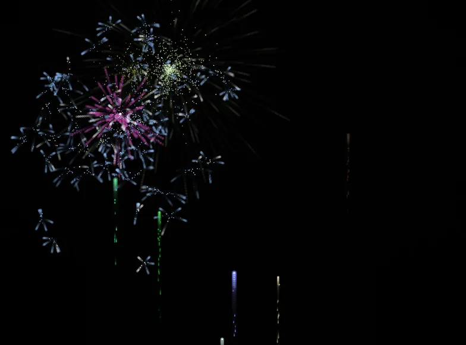
  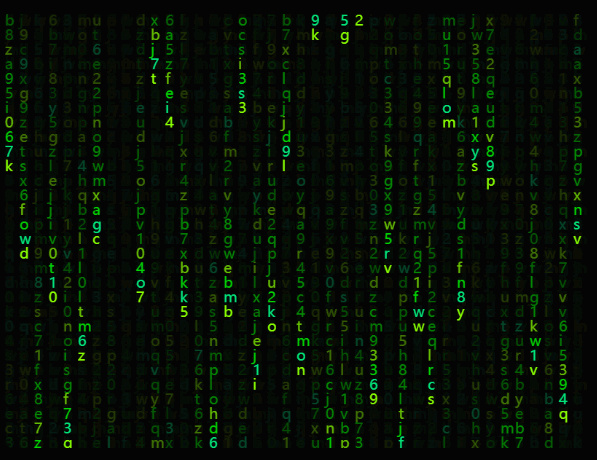
  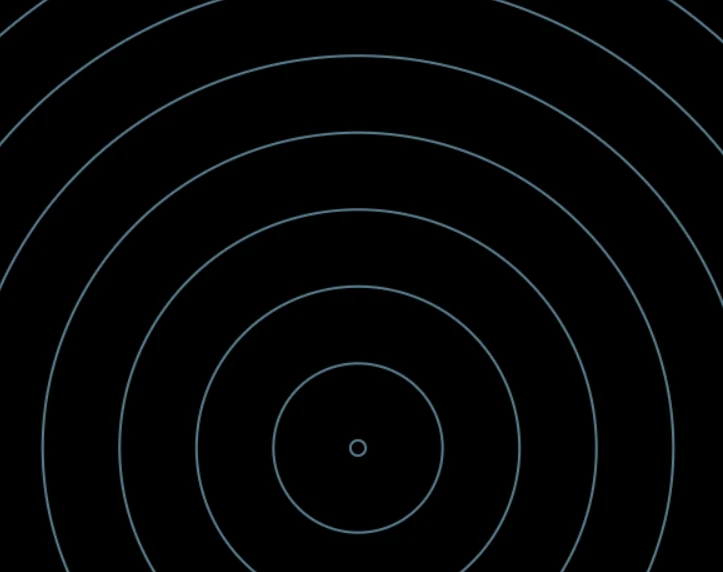
  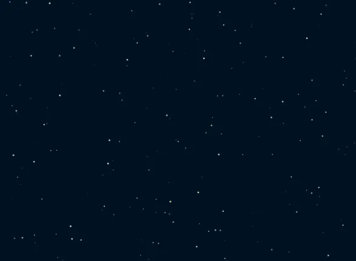
</div>

<div align="center">
  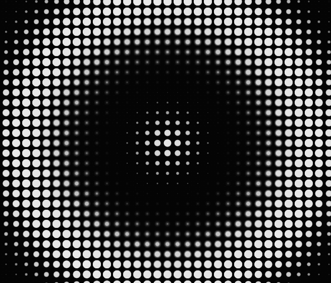
  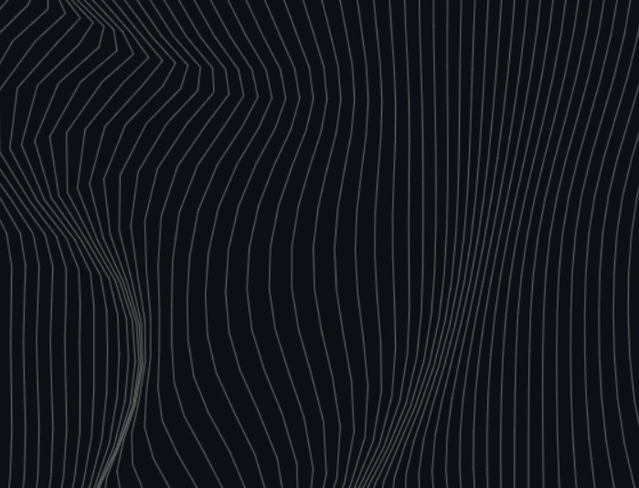
  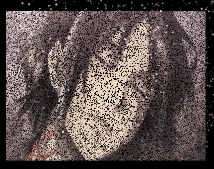
  
</div>

<div align="center">
  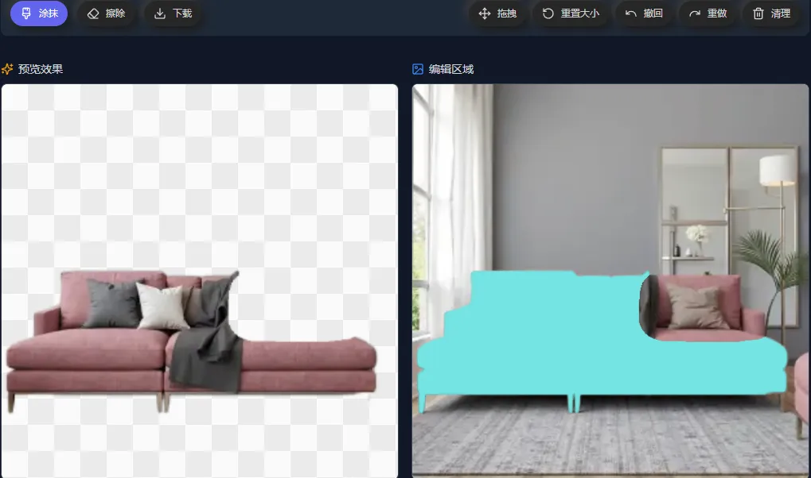
  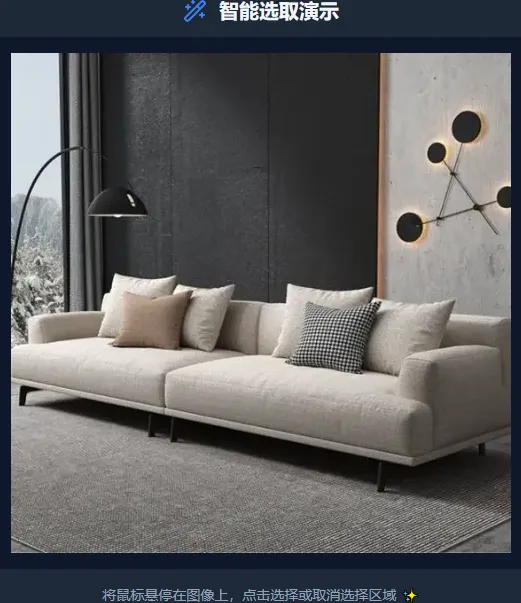
  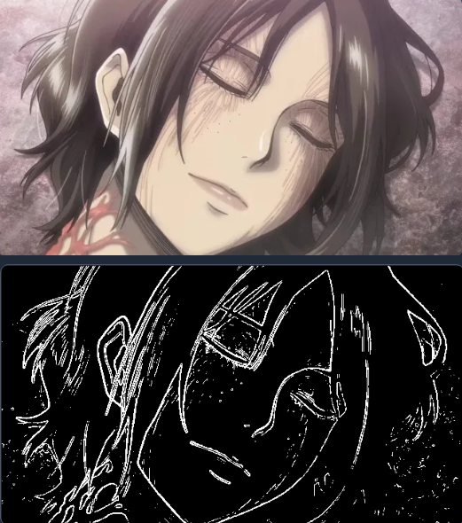
</div>

## ✨ Features

- 🎨 **Rich Visual Effects**: Fireworks, starfield, water ripples, tech digital rain, and many other animation effects
- 🖼️ **Image Processing Tools**: Cutout, smart selection, image to text, image fade, edge extraction, noise addition, watermark addition, etc.
- 📊 **Image Data Processing**: Grayscale, contrast enhancement, binarization, color replacement, and other ImageData processing algorithms
- 🎯 **Interactive Components**: Scratch card, screenshot tool, drawing board, etc.
- 🎬 **Video Processing**: Video frame capture, timeline navigation, batch frame extraction, etc.
- 📱 **Responsive Design**: Supports multiple screen sizes and devices
- 🌙 **Theme Support**: Supports light and dark theme switching
- 🔧 **Highly Configurable**: All effects provide rich configuration options
- 📚 **Complete Documentation**: All configurations have Chinese documentation comments, see TS type files and documentation comments

## Installation

```bash
npm i @jl-org/cvs
```

## Example Pages Directory

### 📋 Quick Navigation
- [🎆 Firework Effect](#-firework-effect) - `/firework`
- [🌍 Globe Sphere](#-globe-sphere) - `/globeSphere`
- [📐 Grid Effect](#-grid-effect) - `/grid`
- [🌀 Halftone Wave](#-halftone-wave) - `/halftoneWave`
- [🖼️ Image Fade Away](#️-image-fade-away) - `/imgToFade`
- [📝 Image to Text](#-image-to-text) - `/imgToTxt`
- [🎨 Image Editing Board](#-image-editing-board) - `/noteBoard`
- [🎯 Scratch Card Effect](#-scratch-card-effect) - `/scratch`
- [📸 Screenshot Tool](#-screenshot-tool) - `/shotImg`
- [⭐ Star Field Scene](#-star-field-scene) - `/starField`
- [💡 Smart Selection](#-smart-selection) - `/smartSelection`
- [✂️ Cutout Tool](#️-cutout-tool) - `/cutoutImg`
- [🔢 Tech Digital](#-tech-digital) - `/techNum`
- [🌊 Water Ripple Effect](#-water-ripple-effect) - `/waterRipple`
- [〰️ Wavy Lines](#️-wavy-lines) - `/wavyLines`
- [🖼️ Image Processing](#️-image-processing) - `/imgProcessing`
- [📊 Image Data Processing](#-image-data-processing) - `/imgDataProcessing`
- [🔍 Image Edge Detection](#-image-edge-detection) - `/imgEdgeDetection`
- [🎬 Capture Video Frame](#-capture-video-frame) - `/captureVideoFrame`

### Running Test Pages

```bash
# Install dependencies
pnpm install

# Build core package
pnpm build
# Start test pages
pnpm test
```

Visit http://localhost:5173 to view all test pages

---

## 🎆 Firework Effect

- **View Online**: https://jl-cvs.pages.dev/firework
- [File Location](./packages/test/src/views/firework/index.tsx)


**Features**:
- Two firework types: classic fireworks and two-stage explosion fireworks
- Multiple color theme presets
- Real-time parameter adjustment
- Auto-play and manual control
- Rich visual effects

**Firework Types**:
- 🎆 Classic Fireworks: Traditional firework explosion effects
- 💥 Two-stage Explosion Fireworks: More complex multi-layer explosion effects

## 🌍 Globe Sphere

- **View Online**: https://jl-cvs.pages.dev/globeSphere
- [File Location](./packages/test/src/views/globeSphere/index.tsx)

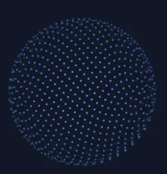

**Features**:
- 3D sphere rotation effect
- Globe-style rendering
- Interactive controls
- Smooth animation transitions

---

## ✂️ Cutout Tool

- **View Online**: https://jl-cvs.pages.dev/cutoutImg


**Features**:
- **Brush Editing**: Supports brush painting and erasing with real-time cutout preview
- **Parameter Adjustment**: Customizable brush thickness
- **Interactive Controls**: Supports undo, redo, drag, and clear canvas
- **Image Export**: Can download edited images

**Usage**:
- Use brush to paint areas you want to keep on the left canvas
- Right side will show real-time cutout preview
- Adjust brush size through toolbar or switch to drag mode
- Download image when finished

---

## 💡 Smart Selection

- **View Online**: https://jl-cvs.pages.dev/smartSelection


**Features**:
- **Smart Recognition**: Automatically identifies different regions in images
- **Hover Highlight**: Highlights selectable areas on mouse hover
- **Click Selection**: Single click to select or deselect regions
- **Multi-region Selection**: Supports simultaneous selection of multiple independent regions

**Usage**:
- Move mouse over image, interactive areas will be highlighted
- Click highlighted areas to select them
- Click again to deselect

---

## 📐 Grid Effect

- **View Online**: https://jl-cvs.pages.dev/grid
- [File Location](./packages/test/src/views/grid/index.tsx)

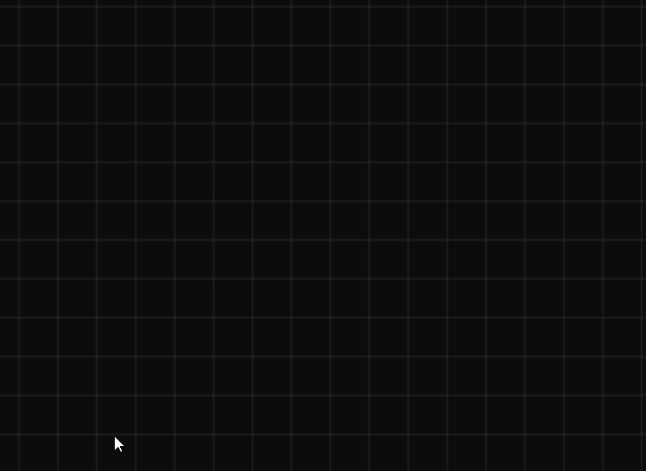

**Features**:
- Dynamic grid background
- Grid line animations
- Adjustable grid density
- Multiple style options

## 🌀 Halftone Wave

- **View Online**: https://jl-cvs.pages.dev/halftoneWave
- [File Location](./packages/test/src/views/halftoneWave/index.tsx)


**Features**:
- Halftone-style wave animation
- Dynamic dot matrix effects
- Adjustable wave parameters
- Multiple visual styles

## 🖼️ Image Fade Away

- **View Online**: https://jl-cvs.pages.dev/imgToFade
- [File Location](./packages/test/src/views/imgToFade/index.tsx)


**Features**:
- Image gradient fade effects
- Multiple fade modes
- Real-time preview
- Custom fade parameters

## 📝 Image to Text

- **View Online**: https://jl-cvs.pages.dev/imgToTxt
- [File Location](./packages/test/src/views/imgToTxt/index.tsx)

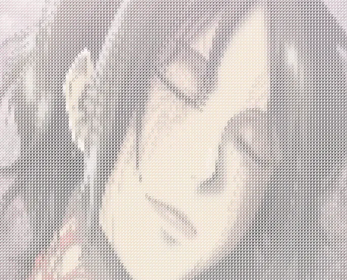

**Features**:
- Convert images to ASCII characters
- Multiple character set options
- Adjustable conversion precision
- Real-time conversion preview

## 🎨 Image Editing Board

- **View Online**: https://jl-cvs.pages.dev/noteBoard
- [File Location](./packages/test/src/views/noteBoard/index.tsx)
- [Architecture Design Documentation](packages/jl-cvs/src/NoteBoard/README.md)

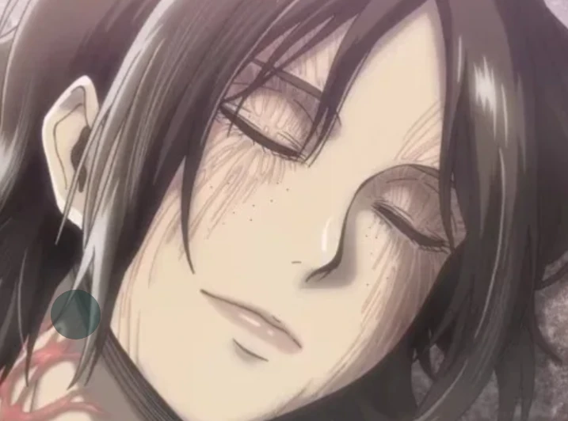

**Features**:
- Full-featured Canvas drawing board component
- Multiple drawing modes: draw, erase, drag, shape drawing
- Supports undo/redo operations
- Image upload and background setting
- Layered export functionality
- Custom brush styles

**Drawing Modes**:
- ✏️ Draw: Free drawing lines
- 🧽 Erase: Erase drawn content
- ✋ Drag: Drag and move canvas
- ⬜ Rectangle: Draw rectangle shapes
- ⭕ Circle: Draw circle shapes
- ➡️ Arrow: Draw arrow shapes

## 🎯 Scratch Card Effect

- **View Online**: https://jl-cvs.pages.dev/scratch
- [File Location](./packages/test/src/views/scratch/index.tsx)

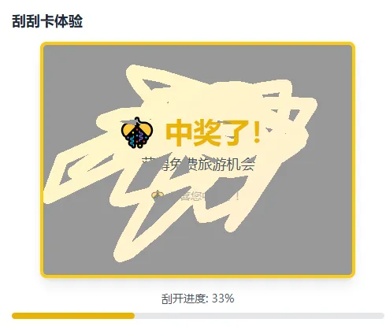

**Features**:
- Realistic scratch card interaction experience
- Customizable scratch thickness and style
- Real-time scratch progress calculation
- Multiple preset configurations
- Support for mouse and touch operations

**Configuration Options**:
- **bg**: Scratch card background color
- **lineWidth**: Scratch line thickness
- **lineCap**: Line cap style (round/square/butt)
- **lineJoin**: Line join style (round/bevel/miter)

## 📸 Screenshot Tool

- **View Online**: https://jl-cvs.pages.dev/shotImg
- [File Location](./packages/test/src/views/shotImg/index.tsx)


**Features**:
- Drag to select screenshot area
- Support image upload and preview
- Real-time display of selection area dimensions
- Support multiple output formats (base64/blob)
- Adjustable mask transparency

**Usage**:
- After uploading image, drag on canvas to select screenshot area
- Support precise pixel-level selection
- Can export selected area as image

## ⭐ Star Field Scene

- **View Online**: https://jl-cvs.pages.dev/starField
- [File Location](./packages/test/src/views/starField/index.tsx)


**Features**:
- Dynamic starfield background effect
- Star twinkling and movement animations
- Customizable star count, size, color
- Support multiple color themes
- Responsive canvas size adjustment

**Configuration Options**:
- **starCount**: Number of stars (default 300)
- **sizeRange**: Star size range [min, max]
- **speedRange**: Movement speed range
- **colors**: Star color array or generation function
- **backgroundColor**: Background color
- **flickerSpeed**: Flicker frequency

## 🔢 Tech Digital

- **View Online**: https://jl-cvs.pages.dev/techNum
- [File Location](./packages/test/src/views/techNum/index.tsx)


**Features**:
- "Matrix" style digital rain effect
- Customizable character sets and colors
- Multiple font options
- Adjustable flow speed and density
- Classic green hacker theme

**Configuration Options**:
- **colWidth**: Character column width
- **fontSize**: Font size
- **font**: Font type (supports monospace fonts)
- **maskColor**: Mask color (for fade effect)
- **gapRate**: Column reset probability (0-1)
- **durationMS**: Animation interval time
- **getStr**: Custom character generation function
- **getColor**: Custom color generation function

## 🌊 Water Ripple Effect

- **View Online**: https://jl-cvs.pages.dev/waterRipple
- [File Location](./packages/test/src/views/waterRipple/index.tsx)


**Features**:
- Realistic water ripple spreading animation
- Adjustable ripple center position
- Multiple preset effects (fast ripples, slow large ripples, colorful gradients)
- Support custom stroke styles
- Real-time parameter adjustment

**Configuration Options**:
- **width/height**: Canvas dimensions
- **xOffset/yOffset**: Ripple center offset
- **lineWidth**: Ripple line width
- **circleCount**: Number of simultaneous ripple circles
- **intensity**: Animation speed intensity
- **strokeStyle**: Custom stroke style

## 〰️ Wavy Lines

- **View Online**: https://jl-cvs.pages.dev/wavyLines
- [File Location](./packages/test/src/views/wavyLines/index.tsx)


**Features**:
- Dynamic wavy lines background
- Mouse interaction effects
- Adjustable line density and spacing
- Multiple color themes
- Smooth animation transitions

**Configuration Options**:
- **xGap/yGap**: Line spacing
- **extraWidth/extraHeight**: Extra drawing area
- **mouseEffectRange**: Mouse effect range
- **strokeStyle**: Line color

---

## 🖼️ Image Processing

- **View Online**: https://jl-cvs.pages.dev/imgProcessing
- [File Location](./packages/test/src/views/imgProcessing/index.tsx)

**Features**:
- **Noise Processing**: Add noise effects to images with adjustable noise intensity
- **Watermark Addition**: Support custom text watermarks with configurable font size, spacing, color, and rotation angle
- **Real-time Preview**: Display processing effects in real-time when adjusting parameters
- **Original Comparison**: Side-by-side display of original and processed images

**Configuration Options**:
- **noiseLevel**: Noise intensity (higher values mean more noise)
- **watermarkText**: Watermark text content
- **fontSize**: Watermark font size
- **gap**: Watermark spacing
- **color**: Watermark color (supports transparency)
- **rotate**: Watermark rotation angle

## 📊 Image Data Processing

- **View Online**: https://jl-cvs.pages.dev/imgDataProcessing
- [File Location](./packages/test/src/views/imgDataProcessing/index.tsx)

**Features**:
- **Grayscale Processing**: Convert color images to grayscale using weighted grayscale algorithm
- **Contrast Enhancement**: Adjust image contrast to make details clearer
- **Binarization Processing**: Convert images to black and white for image recognition scenarios
- **Color Replacement**: Replace specified colors in images with target colors
- **Combined Processing**: Support combination of multiple algorithms

**Configuration Options**:
- **contrastFactor**: Contrast enhancement factor (default 1.2)
- **binarizeThreshold**: Binarization threshold (0-255)
- **fromColor/toColor**: Source and target colors for color replacement

## 🔍 Image Edge Detection

- **View Online**: https://jl-cvs.pages.dev/imgEdgeDetection
- [File Location](./packages/test/src/views/imgEdgeDetection/index.tsx)


**Features**:
- **Edge Extraction**: Use Sobel operator to detect image edges
- **Threshold Adjustment**: Adjustable edge detection sensitivity threshold
- **Real-time Processing**: Display edge detection results in real-time when adjusting parameters
- **Original Comparison**: Side-by-side display of original and edge detection results

**Configuration Options**:
- **threshold**: Edge detection threshold (0-255, lower values detect more edges)

## 🎬 Capture Video Frame

- **View Online**: https://jl-cvs.pages.dev/captureVideoFrame
- [File Location](./packages/test/src/views/captureVideoFrame/index.tsx)

**Features**:
- **Video Upload**: Support drag-and-drop or click to upload video files
- **Timeline Navigation**: Intuitive video timeline for precise frame positioning
- **Batch Capture**: Support capturing multiple frames at different time points
- **High Quality Output**: Support adjustable output image quality and format
- **Download Function**: Can download captured frame images

**Usage**:
- Upload video file or use default demo video
- Click or drag on timeline to select time points for capture
- Support precise millisecond-level frame positioning
- Can batch capture multiple frames and download

---

## 📚 API Function Documentation

### Categories
- **🖼️ Image Processing**: noise, watermark, composition, crop, compress, canvas export, download & conversions
- **✂️ Cutout**: mask generation, composite cutout, smooth edge
- **🔍 Image Edges**: Sobel edge detection
- **🎬 Capture Video Frame**: Worker-first with Canvas fallback
- **🧪 ImageData Processing**: grayscale, contrast, binarize, color replace, grayscale array
- **🧰 Canvas Helpers**: font, clear, DPR, coordinate, pixel helpers, size utils
- **🎨 Color Utilities**: RGBA parse, RGB/HEX convert, opacity utilities
- **⚙️ Utilities**: debounce/throttle, deep clone, random number, string utils, undo/redo linked list
- **🧩 SVG**: board, grid, text
- **✨ Effects & Components**: Grid, DotGrid, HalftoneWave, WavyLines, WaterRipple, GlobeSphere, StarField, ShotImg, NoteBoard, Firework, TechNum

---

### 🖼️ Image Processing
- **imgToNoise(img, level?)**: add noise to image
  - Usage:
  ```ts
  const cvs = imgToNoise(img)
  document.body.appendChild(cvs)
  ```

- **waterMark({ text, fontSize, gap, color, rotate })**: generate tiled watermark
  - Returns: `{ base64, size }`
  - Usage:
  ```css
  background-image: url(${base64})
  background-size: ${size}px ${size}px
  ```

- **composeImg([{ src, left, top }], width, height)**: compose multiple images and export base64
  - Usage:
  ```ts
  const base64 = await composeImg([
    { src: '/bg.png' },
    { src: fileBlob, left: 40, top: 60 },
  ], 800, 600)
  ```

- **cutImg(img, opts, resType?)**: crop area from image, export base64/blob
  - Keys: `x y width height mimeType quality`

- **compressImg(img, resType?, quality?, mimeType?)**: compress image (`image/jpeg | image/webp`)

- **getCvsImg(cvs, resType?, mimeType?, quality?)**: export canvas to base64/blob

- **Download & conversions**:
  - `downloadByData(data, filename)`, `downloadByUrl(url, filename)`
  - `blobToBase64(blob)`, `base64ToBlob(base64, mimeType?)`
  - `urlToBlob(url)`, `getImg(src)`

---

### ✂️ Cutout
- **cutoutImgToMask(imgUrl, replaceColor, opts?)**: turn cutout into mask (replace non-transparent areas)
  - Options: `smoothEdge`, `smoothRadius`, `alphaThreshold`, `ignoreAlpha`, `handleAlpha`

- **cutoutImg(original, mask)**: extract opaque areas of mask from original image (transparent PNG output)

- **cutoutImgSmoothed(original, mask, { blurRadius, featherAmount })**: per-pixel smooth cutout, returns `ImageData`

---

### 🔍 Image Edges
- **getImgEdge(source, { threshold }?)**: Sobel edge detection
  - `source` can be URL or `ImageData`, returns `ImageData`

---

### 🎬 Capture Video Frame
- **captureVideoFrame(fileOrUrl, time, resType?, options?)**: capture frames at given time(s)
  - Uses Worker with `ImageCapture` when available, fallback to Canvas
  - `time` can be number or array, `resType` is `'base64' | 'blob'`
  - Example:
  ```ts
  const frames = await captureVideoFrame(file, [1, 2, 8], 'base64', {
    quality: 0.6
  })
  ```

---

### 🧪 ImageData Processing
- **adaptiveGrayscale(imageData)**: weighted grayscale
- **enhanceContrast(imageData, factor=1.2)**: contrast enhancement
- **adaptiveBinarize(imageData, threshold=128)**: binarization (call after grayscale & contrast)
- **changeImgColor(imgOrUrl, fromColor, toColor, opts?)**: replace color with optional matcher
  - Example:
  ```ts
  const { base64 } = await changeImgColor('/a.png', '#ff0000', 'rgba(0, 0, 255, .5)')
  ```
- **getGrayscaleArray(imageData)**: returns `Uint8Array`

> Note: Removed `pickImgArea` and `invertImgArea` from docs (not in codebase).

---

### 🧰 Canvas Helpers
- Basics:
  - **setFont(ctx, { size, family, weight, textAlign, textBaseline, color })**
  - **clearAllCvs(ctx, canvas)**
  - **getDPR(max=2)**
  - **timeFunc(str) / genTimeFunc(str)**: time function generator (easing/tempo)
- Size/coordinate:
  - **getWinWidth() / getWinHeight()**, **calcCoord(r, deg)**
  - **createCvs(width?, height?, options?) => { cvs, ctx }**
- Pixel/data:
  - **getImgData(imgOrUrl)**, **getImgDataIndex(x, y, width)**
  - **getPixel(x, y, imgData)**, **parseImgData(imgData)**, **fillPixel(ctx, x, y, color)**
  - **eachPixel(imgData, cb)**, **scaleImgData(imgData, scaleX, scaleY)**

---

### 🎨 Color Utilities
- **getColorInfo(color)**, **getColor() / getColorArr(size)**
- **hexColorToRaw(color)**, **hexToRGB(color)**, **rgbToHex(color)**
- **lightenColor(color, strength?)**, **colorAddOpacity(color, opacity?)**

### ⚙️ Utilities
- **debounce(fn, wait)** / **throttle(fn, wait)**
- **deepClone(obj)**, **excludeKeys(obj, keys)**
- **getRandomNum(min, max)**, **randomStr(len)**, **numFixed(num, digits)**
- **UnRedoLinkedList** / **createUnReDoList**

---

### 🧩 SVG
- **genSvgBoard(width?, height?, gap?, opts?)** → `{ svg, g }`
- **genBoard(width?, height?, gap?, opts?)** → `g`
- **genSvg(viewBox?, width?, height?)** → `svg`
- **genGrid(width?, height?, gap?, opts?)** → `path`
- **genGridPath(width?, height?, gap?, needHorizontal?, needVertical?)** → `d`
- **genTextArr(width?, height?, gap?, opts?)** → text elements

---

### ✨ Effects & Components
- **Grid(canvas, options?)**, **DotGrid(canvas, options?)**
- **HalftoneWave(canvas, options?)**, **WavyLines({ canvas, ... })**
- **WaterRipple(options?)**
  ```ts
  const ripple = new WaterRipple({ circleCount: 10 })
  document.body.appendChild(ripple.canvas)
  ```
- **GlobeSphere(canvas, options?)**, **StarField(canvas, options?)**
- **imgToFade(bgCanvas, opts)**: image fade-away particles
- **imgToTxt(options)**: image/video to text rendering
- **ShotImg(canvas, img?, opacity?)**
  ```ts
  const s = new ShotImg(cvs, img)
  const shot = await s.getShotImg('base64')
  ```
- **NoteBoard(options)** / **NoteBoardWithBase64(options)**
- **createScratch(canvas, opts?)**: scratch card interaction
- **createFirework(canvas, opts?)** / **createFirework2(canvas, opts)**
- **createTechNum(options)**
