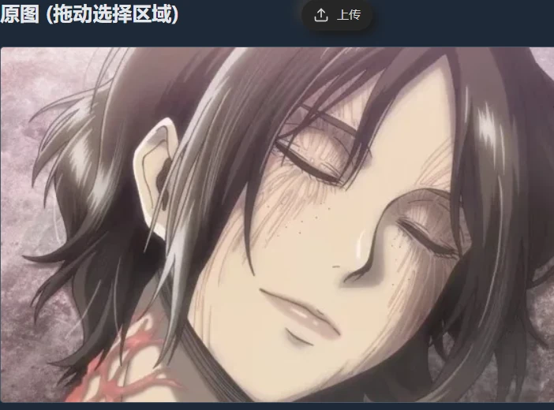
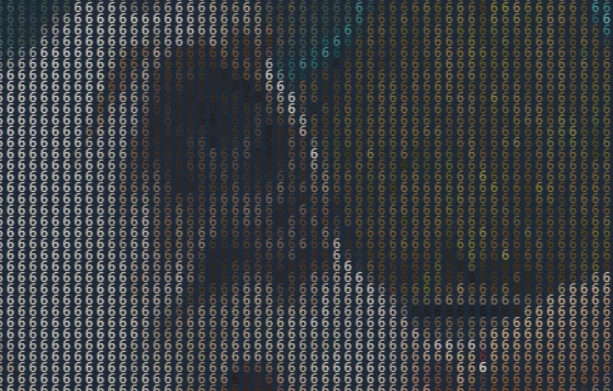
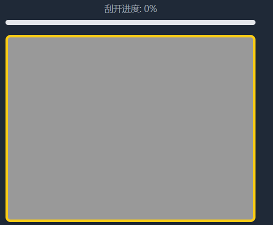

# Amazing Canvas Effects and Utility Tools

<div align="center">
  <a href="./README.en.md">English</a>
  <a href="./README.md">中文</a>
</div>

<br />

<p align="center">
  
  
  
  
  
  
</p>

A feature-rich Canvas effects library that provides various stunning visual effects and practical tools. Includes fireworks, starfield, water ripples, tech digital rain, and many other animation effects, as well as practical functions like image processing, screenshot capture, drawing, and image cutout.

## 🎬 Effects Preview

Please visit GitHub to see more: https://github.com/beixiyo/jl-cvs

<div align="center">
  
  
  
  
</div>

<div align="center">
  
  
  
  
</div>

<div align="center">
  
  
  
</div>

## ✨ Features

- 🎨 **Rich Visual Effects**: Fireworks, starfield, water ripples, tech digital rain, and many other animation effects
- 🖼️ **Image Processing Tools**: Cutout, smart selection, image to text, image fade, edge extraction, noise addition, watermark addition, etc.
- 📊 **Image Data Processing**: Grayscale, contrast enhancement, binarization, color replacement, and other ImageData processing algorithms
- 🎯 **Interactive Components**: Scratch card, screenshot tool, drawing board, etc.
- 🎬 **Video Processing**: Video frame capture, timeline navigation, batch frame extraction, etc.
- 📱 **Responsive Design**: Supports multiple screen sizes and devices
- 🌙 **Theme Support**: Supports light and dark theme switching
- 🔧 **Highly Configurable**: All effects provide rich configuration options
- 📚 **Complete Documentation**: All configurations have Chinese documentation comments, see TS type files and documentation comments

## Installation

```bash
npm i @jl-org/cvs
```

## Example Pages Directory

### 📋 Quick Navigation
- [🎆 Firework Effect](#-firework-effect) - `/firework`
- [🌍 Globe Sphere](#-globe-sphere) - `/globeSphere`
- [📐 Grid Effect](#-grid-effect) - `/grid`
- [🌀 Halftone Wave](#-halftone-wave) - `/halftoneWave`
- [🖼️ Image Fade Away](#️-image-fade-away) - `/imgToFade`
- [📝 Image to Text](#-image-to-text) - `/imgToTxt`
- [🎨 Image Editing Board](#-image-editing-board) - `/noteBoard`
- [🎯 Scratch Card Effect](#-scratch-card-effect) - `/scratch`
- [📸 Screenshot Tool](#-screenshot-tool) - `/shotImg`
- [⭐ Star Field Scene](#-star-field-scene) - `/starField`
- [💡 Smart Selection](#-smart-selection) - `/smartSelection`
- [✂️ Cutout Tool](#️-cutout-tool) - `/cutoutImg`
- [🔢 Tech Digital](#-tech-digital) - `/techNum`
- [🌊 Water Ripple Effect](#-water-ripple-effect) - `/waterRipple`
- [〰️ Wavy Lines](#️-wavy-lines) - `/wavyLines`
- [🖼️ Image Processing](#️-image-processing) - `/imgProcessing`
- [📊 Image Data Processing](#-image-data-processing) - `/imgDataProcessing`
- [🔍 Image Edge Detection](#-image-edge-detection) - `/imgEdgeDetection`
- [🎬 Capture Video Frame](#-capture-video-frame) - `/captureVideoFrame`

### Running Test Pages

```bash
# Install dependencies
pnpm install

# Build core package
pnpm build
# Start test pages
pnpm test
```

Visit http://localhost:5173 to view all test pages

---

## 🎆 Firework Effect

- **View Online**: https://jl-cvs.pages.dev/firework
- [File Location](./packages/test/src/views/firework/index.tsx)


**Features**:
- Two firework types: classic fireworks and two-stage explosion fireworks
- Multiple color theme presets
- Real-time parameter adjustment
- Auto-play and manual control
- Rich visual effects

**Firework Types**:
- 🎆 Classic Fireworks: Traditional firework explosion effects
- 💥 Two-stage Explosion Fireworks: More complex multi-layer explosion effects

## 🌍 Globe Sphere

- **View Online**: https://jl-cvs.pages.dev/globeSphere
- [File Location](./packages/test/src/views/globeSphere/index.tsx)


**Features**:
- 3D sphere rotation effect
- Globe-style rendering
- Interactive controls
- Smooth animation transitions

---

## ✂️ Cutout Tool

- **View Online**: https://jl-cvs.pages.dev/cutoutImg


**Features**:
- **Brush Editing**: Supports brush painting and erasing with real-time cutout preview
- **Parameter Adjustment**: Customizable brush thickness
- **Interactive Controls**: Supports undo, redo, drag, and clear canvas
- **Image Export**: Can download edited images

**Usage**:
- Use brush to paint areas you want to keep on the left canvas
- Right side will show real-time cutout preview
- Adjust brush size through toolbar or switch to drag mode
- Download image when finished

---

## 💡 Smart Selection

- **View Online**: https://jl-cvs.pages.dev/smartSelection


**Features**:
- **Smart Recognition**: Automatically identifies different regions in images
- **Hover Highlight**: Highlights selectable areas on mouse hover
- **Click Selection**: Single click to select or deselect regions
- **Multi-region Selection**: Supports simultaneous selection of multiple independent regions

**Usage**:
- Move mouse over image, interactive areas will be highlighted
- Click highlighted areas to select them
- Click again to deselect

---

## 📐 Grid Effect

- **View Online**: https://jl-cvs.pages.dev/grid
- [File Location](./packages/test/src/views/grid/index.tsx)


**Features**:
- Dynamic grid background
- Grid line animations
- Adjustable grid density
- Multiple style options

## 🌀 Halftone Wave

- **View Online**: https://jl-cvs.pages.dev/halftoneWave
- [File Location](./packages/test/src/views/halftoneWave/index.tsx)


**Features**:
- Halftone-style wave animation
- Dynamic dot matrix effects
- Adjustable wave parameters
- Multiple visual styles

## 🖼️ Image Fade Away

- **View Online**: https://jl-cvs.pages.dev/imgToFade
- [File Location](./packages/test/src/views/imgToFade/index.tsx)


**Features**:
- Image gradient fade effects
- Multiple fade modes
- Real-time preview
- Custom fade parameters

## 📝 Image to Text

- **View Online**: https://jl-cvs.pages.dev/imgToTxt
- [File Location](./packages/test/src/views/imgToTxt/index.tsx)



**Features**:
- Convert images to ASCII characters
- Multiple character set options
- Adjustable conversion precision
- Real-time conversion preview

## 🎨 Image Editing Board

- **View Online**: https://jl-cvs.pages.dev/noteBoard
- [File Location](./packages/test/src/views/noteBoard/index.tsx)
- [Architecture Design Documentation](packages/jl-cvs/src/NoteBoard/README.md)


**Features**:
- Full-featured Canvas drawing board component
- Multiple drawing modes: draw, erase, drag, shape drawing
- Supports undo/redo operations
- Image upload and background setting
- Layered export functionality
- Custom brush styles

**Drawing Modes**:
- ✏️ Draw: Free drawing lines
- 🧽 Erase: Erase drawn content
- ✋ Drag: Drag and move canvas
- ⬜ Rectangle: Draw rectangle shapes
- ⭕ Circle: Draw circle shapes
- ➡️ Arrow: Draw arrow shapes

## 🎯 Scratch Card Effect

- **View Online**: https://jl-cvs.pages.dev/scratch
- [File Location](./packages/test/src/views/scratch/index.tsx)



**Features**:
- Realistic scratch card interaction experience
- Customizable scratch thickness and style
- Real-time scratch progress calculation
- Multiple preset configurations
- Support for mouse and touch operations

**Configuration Options**:
- **bg**: Scratch card background color
- **lineWidth**: Scratch line thickness
- **lineCap**: Line cap style (round/square/butt)
- **lineJoin**: Line join style (round/bevel/miter)

## 📸 Screenshot Tool

- **View Online**: https://jl-cvs.pages.dev/shotImg
- [File Location](./packages/test/src/views/shotImg/index.tsx)


**Features**:
- Drag to select screenshot area
- Support image upload and preview
- Real-time display of selection area dimensions
- Support multiple output formats (base64/blob)
- Adjustable mask transparency

**Usage**:
- After uploading image, drag on canvas to select screenshot area
- Support precise pixel-level selection
- Can export selected area as image

## ⭐ Star Field Scene

- **View Online**: https://jl-cvs.pages.dev/starField
- [File Location](./packages/test/src/views/starField/index.tsx)


**Features**:
- Dynamic starfield background effect
- Star twinkling and movement animations
- Customizable star count, size, color
- Support multiple color themes
- Responsive canvas size adjustment

**Configuration Options**:
- **starCount**: Number of stars (default 300)
- **sizeRange**: Star size range [min, max]
- **speedRange**: Movement speed range
- **colors**: Star color array or generation function
- **backgroundColor**: Background color
- **flickerSpeed**: Flicker frequency

## 🔢 Tech Digital

- **View Online**: https://jl-cvs.pages.dev/techNum
- [File Location](./packages/test/src/views/techNum/index.tsx)


**Features**:
- "Matrix" style digital rain effect
- Customizable character sets and colors
- Multiple font options
- Adjustable flow speed and density
- Classic green hacker theme

**Configuration Options**:
- **colWidth**: Character column width
- **fontSize**: Font size
- **font**: Font type (supports monospace fonts)
- **maskColor**: Mask color (for fade effect)
- **gapRate**: Column reset probability (0-1)
- **durationMS**: Animation interval time
- **getStr**: Custom character generation function
- **getColor**: Custom color generation function

## 🌊 Water Ripple Effect

- **View Online**: https://jl-cvs.pages.dev/waterRipple
- [File Location](./packages/test/src/views/waterRipple/index.tsx)


**Features**:
- Realistic water ripple spreading animation
- Adjustable ripple center position
- Multiple preset effects (fast ripples, slow large ripples, colorful gradients)
- Support custom stroke styles
- Real-time parameter adjustment

**Configuration Options**:
- **width/height**: Canvas dimensions
- **xOffset/yOffset**: Ripple center offset
- **lineWidth**: Ripple line width
- **circleCount**: Number of simultaneous ripple circles
- **intensity**: Animation speed intensity
- **strokeStyle**: Custom stroke style

## 〰️ Wavy Lines

- **View Online**: https://jl-cvs.pages.dev/wavyLines
- [File Location](./packages/test/src/views/wavyLines/index.tsx)


**Features**:
- Dynamic wavy lines background
- Mouse interaction effects
- Adjustable line density and spacing
- Multiple color themes
- Smooth animation transitions

**Configuration Options**:
- **xGap/yGap**: Line spacing
- **extraWidth/extraHeight**: Extra drawing area
- **mouseEffectRange**: Mouse effect range
- **strokeStyle**: Line color

---

## 🖼️ Image Processing

- **View Online**: https://jl-cvs.pages.dev/imgProcessing
- [File Location](./packages/test/src/views/imgProcessing/index.tsx)

**Features**:
- **Noise Processing**: Add noise effects to images with adjustable noise intensity
- **Watermark Addition**: Support custom text watermarks with configurable font size, spacing, color, and rotation angle
- **Real-time Preview**: Display processing effects in real-time when adjusting parameters
- **Original Comparison**: Side-by-side display of original and processed images

**Configuration Options**:
- **noiseLevel**: Noise intensity (higher values mean more noise)
- **watermarkText**: Watermark text content
- **fontSize**: Watermark font size
- **gap**: Watermark spacing
- **color**: Watermark color (supports transparency)
- **rotate**: Watermark rotation angle

## 📊 Image Data Processing

- **View Online**: https://jl-cvs.pages.dev/imgDataProcessing
- [File Location](./packages/test/src/views/imgDataProcessing/index.tsx)

**Features**:
- **Grayscale Processing**: Convert color images to grayscale using weighted grayscale algorithm
- **Contrast Enhancement**: Adjust image contrast to make details clearer
- **Binarization Processing**: Convert images to black and white for image recognition scenarios
- **Color Replacement**: Replace specified colors in images with target colors
- **Combined Processing**: Support combination of multiple algorithms

**Configuration Options**:
- **contrastFactor**: Contrast enhancement factor (default 1.2)
- **binarizeThreshold**: Binarization threshold (0-255)
- **fromColor/toColor**: Source and target colors for color replacement

## 🔍 Image Edge Detection

- **View Online**: https://jl-cvs.pages.dev/imgEdgeDetection
- [File Location](./packages/test/src/views/imgEdgeDetection/index.tsx)


**Features**:
- **Edge Extraction**: Use Sobel operator to detect image edges
- **Threshold Adjustment**: Adjustable edge detection sensitivity threshold
- **Real-time Processing**: Display edge detection results in real-time when adjusting parameters
- **Original Comparison**: Side-by-side display of original and edge detection results

**Configuration Options**:
- **threshold**: Edge detection threshold (0-255, lower values detect more edges)

## 🎬 Capture Video Frame

- **View Online**: https://jl-cvs.pages.dev/captureVideoFrame
- [File Location](./packages/test/src/views/captureVideoFrame/index.tsx)

**Features**:
- **Video Upload**: Support drag-and-drop or click to upload video files
- **Timeline Navigation**: Intuitive video timeline for precise frame positioning
- **Batch Capture**: Support capturing multiple frames at different time points
- **High Quality Output**: Support adjustable output image quality and format
- **Download Function**: Can download captured frame images

**Usage**:
- Upload video file or use default demo video
- Click or drag on timeline to select time points for capture
- Support precise millisecond-level frame positioning
- Can batch capture multiple frames and download

---

## 📚 API Function Documentation

### All Functions

- [Image Processing](#image-processing-api)
- [Cutout](#cutout-api)
- [Extract Image Edges](#extract-image-edges-api)
- [Capture Video Frame](#capture-video-frame-api)
- [ImageData Processing, Grayscale, Contrast, Binarization, etc.](#imagedata-processing-api)
<br />

- [Helper Functions](#canvas-helper-functions-api)
- [Color Processing](#color-processing-api)
- [SVG](#svg-api)

---

### Image Processing API

```ts
/**
 * Add noise to image
 * @param img Image element
 * @param level Noise level, default 100
 */
export declare function imgToNoise(img: HTMLImageElement, level?: number): HTMLCanvasElement

/**
 * Add watermark
 * Returns base64 and image size, you can set it with CSS
 * @example
 * background-image: url(${base64});
 * background-size: ${size}px ${size}px;
 */
export declare function waterMark({ fontSize, gap, text, color, rotate }: WaterMarkOpts): {
  base64: string
  size: number
}

/**
 * Compose images layer by layer using Canvas, supports base64 | blob
 */
export declare function composeImg(srcs: Array<{
  src: string | Blob
  left?: number
  top?: number
  setImg?: (img: HTMLImageElement) => void
}>, width: number, height: number): Promise<string>

/**
 * Crop specified area of image, can set scaling, returns base64 | blob
 * @param img Image element
 * @param opts Configuration options
 * @param resType Return file format, default `base64`
 */
export declare function cutImg<T extends TransferType = 'base64'>(img: HTMLImageElement, opts?: CutImgOpts, resType?: T): Promise<HandleImgReturn<T>>

/**
 * Compress image
 * @param img Image element
 * @param resType Return file format, default `base64`
 * @param quality Compression quality, default 0.5
 * @param mimeType Image type, default `image/webp`. Only `image/jpeg | image/webp` can be compressed
 * @returns base64 | blob
 */
export declare function compressImg<T extends TransferType = 'base64'>(img: HTMLImageElement, resType?: T, quality?: number, mimeType?: 'image/jpeg' | 'image/webp'): Promise<HandleImgReturn<T>>

/**
 * Convert canvas image to base64 | blob
 * @param cvs Canvas element
 * @param resType Return file format, default `base64`
 * @param mimeType Image MIME format
 * @param quality Compression quality
 */
export declare function getCvsImg<T extends TransferType = 'base64'>(cvs: HTMLCanvasElement, resType?: T, mimeType?: string, quality?: number): Promise<HandleImgReturn<T>>

/**
 * Convert Blob to Base64
 */
export declare function blobToBase64(blob: Blob): Promise<string>

/**
 * Convert Base64 to Blob
 * @param base64Str Base64 string
 * @param mimeType File type, default application/octet-stream
 */
export declare function base64ToBlob(base64Str: string, mimeType?: string): Blob

/**
 * Convert HTTP URL to blob
 */
export declare function urlToBlob(url: string): Promise<Blob>

/**
 * Check if image src is available, returns image if available
 * @param src Image source
 * @param setImg Callback function executed before image loads
 */
export declare const getImg: (src: string, setImg?: ((img: HTMLImageElement) => void) | undefined) => Promise<false | HTMLImageElement>
```

---

### Cutout API
```ts
/**
 * Convert cutout to mask (replace non-transparent areas of image with specified color)
 * @param imgUrl Image URL
 * @param replaceColor Replacement color
 */
export declare function cutoutImgToMask(imgUrl: string, replaceColor: string, { smoothEdge, smoothRadius, alphaThreshold, ignoreAlpha }?: CutImgToMaskOpts): Promise<{
  base64: string
  imgData: ImageData
}>

/**
 * Pass in an original image and a mask image, extract the opaque areas of the mask image.
 * Implemented using **globalCompositeOperation**
 *
 * @param originalImageSource Original image
 * @param maskImageSource Mask image
 */
export declare function cutoutImg(originalImageSource: string | HTMLImageElement, maskImageSource: string | HTMLImageElement): Promise<string>

/**
 * Pass in an original image and a mask image, extract the opaque areas of the mask image, and smooth the extracted areas.
 * Implemented by processing each pixel
 *
 * @param originalImg Original image
 * @param maskImg Mask image
 */
export declare function cutoutImgSmoothed(originalImg: string, maskImg: string, { blurRadius, featherAmount, }?: CutoutImgOpts): Promise<ImageData>
```

---

### Extract Image Edges API
```ts
/**
 * Extract image edges
 * @param source Image URL or ImageData object
 * @param options Configuration options
 */
export declare function getImgEdge(source: string | ImageData, options?: {
  threshold?: number
}): Promise<ImageData>
```

---

### Capture Video Frame API

```ts
/**
 * Example: Use Web Worker to capture frames at 1, 2, 100 seconds
 */
const srcs = await captureVideoFrame(file, [1, 2, 100], 'base64', {
  quality: 0.5,
})

/**
 * Capture a frame from video at specified time, uses last second if exceeds total duration.
 * Uses Worker for frame capture if browser supports ImageCapture, otherwise falls back to Canvas capture.
 * @param fileOrUrl File or URL
 * @param time Time, can be array
 * @param resType Return type
 */
export declare function captureVideoFrame<N extends number | number[], T extends TransferType = 'base64'>(fileOrUrl: File | string, time: N, resType?: T, options?: Options): Promise<N extends number ? HandleImgReturn<T> : HandleImgReturn<T>[]>
```

---

### ImageData Processing API
```ts
/**
 * Grayscale algorithm: weighted grayscale
 * @returns
 */
export declare const adaptiveGrayscale: (imageData: ImageData) => ImageData

/**
 * Contrast enhancement
 * @param factor Factor, default 1.2
 * @returns
 */
export declare const enhanceContrast: (imageData: ImageData, factor?: number) => ImageData

/**
 * Binarization processing, please call first:
 * - adaptiveGrayscale
 * - enhanceContrast
 *
 * Then call this function for best image effect
 *
 * @param threshold Threshold boundary, default 128
 * @returns
 */
export declare const adaptiveBinarize: (imageData: ImageData, threshold?: number) => ImageData

/**
 * Pass in a reference image, returns another image where non-transparent areas of reference image will be cropped out
 * @param rawImg Original image
 * @param referenceImg Reference image
 */
export declare function pickImgArea(rawImg: string, referenceImg: string): Promise<ImageData>

/**
 * Pass in a reference image, returns another image where transparent areas of reference image will be cropped out
 * @param rawImg Original image
 * @param referenceImg Reference image
 */
export declare function invertImgArea(rawImg: string, referenceImg: string): Promise<ImageData>
```

---

### Canvas Helper Functions API
```ts
/**
 * Set font, centered by default
 */
export declare function setFont(ctx: CanvasRenderingContext2D, options: CtxFontOpt): void

/** Clear entire canvas content */
export declare function clearAllCvs(ctx: CanvasRenderingContext2D, canvas: HTMLCanvasElement): void

/**
 * Get DOM coordinates based on radius and angle
 * @param r Radius
 * @param deg Angle
 */
export declare function calcCoord(r: number, deg: number): readonly [number, number]

/**
 * Create a canvas with specified width and height
 * @param width Canvas width
 * @param height Canvas height
 * @param options Context configuration
 * @returns Object containing canvas and context
 */
export declare function createCvs(width?: number, height?: number, options?: CanvasRenderingContext2DSettings): {
  cvs: HTMLCanvasElement
  ctx: CanvasRenderingContext2D
}

/**
 * Extract RGBA array at specific coordinates from canvas color described by one-dimensional array
 * ## Note: coordinates start from 0
 * @param x Column in width
 * @param y Row in height
 * @param imgData ImageData obtained by ctx.getImageData method
 * @returns RGBA array
 */
export declare function getPixel(x: number, y: number, imgData: ImageData): Pixel

/**
 * Beautify ctx.getImageData.data property
 * Each row is a large array, each pixel is a small array
 * @param imgData ImageData obtained by ctx.getImageData method
 */
export declare function parseImgData(imgData: ImageData): Pixel[][]

/** Function to fill a pixel in canvas with color */
export declare function fillPixel(ctx: CanvasRenderingContext2D, x: number, y: number, color: string): void
```

---

### Color Processing API
```ts
/**
 * Extract RGBA from color
 * @example
 * ```ts
 * getColorInfo('rgba(0, 0, 0, 1)')
 * getColorInfo('rgb(0, 0, 0)')
 *
 * getColorInfo('#fff')
 * getColorInfo('#fff1')
 * ```
 */
export declare function getColorInfo(color: string): {
  r: number
  g: number
  b: number
  a: number
}

/** Get random hexadecimal color */
export declare function getColor(): string

/** Random hexadecimal color array */
export declare function getColorArr(size: number): string[]

/**
## Convert hexadecimal color to original length color
  - #000 => #000000
  - #000f => #000000ff
 */
export declare function hexColorToRaw(color: string): string

/** Hexadecimal to RGB */
export declare function hexToRGB(color: string): string

/** RGB to hexadecimal */
export declare function rgbToHex(color: string): string | undefined

/**
 * Lighten color transparency, supports RGB and hexadecimal
 * @param color rgba(0, 239, 255, 1)
 * @param strength Lightening strength
 * @returns Returns RGBA format color like `rgba(0, 0, 0, 0.1)`
 */
export declare function lightenColor(color: string, strength?: number): string

/**
 * Add transparency to color, supports RGB and hexadecimal
 * @param color Color
 * @param opacity Opacity
 * @returns Returns hexadecimal format color like `#ffffff11`
 */
export declare function colorAddOpacity(color: string, opacity?: number): string
```

---

### SVG API
> The functions below, actually *genSvgBoard* | *genBoard*, are sufficient. Other exposed functions are just their internal implementations
```ts
/**
 * Generate SVG chessboard
 * @param width Width
 * @param height Height
 * @param gap Spacing
 * @param opts Text configuration options
 */
export declare function genSvgBoard(width?: number, height?: number, gap?: number, opts?: Opts): {
  svg: SVGSVGElement
  g: SVGGElement
}

/** Generate chessboard path and text elements */
export declare function genBoard(width?: number, height?: number, gap?: number, opts?: Opts): SVGGElement

/** Generate SVG */
export declare function genSvg(viewBox?: string, width?: number, height?: number): SVGSVGElement

/** Generate SVG path grid */
export declare function genGrid(width?: number, height?: number, gap?: number, opts?: GridOpts): SVGPathElement

/**
 * Generate grid path
 * @param width Width
 * @param height Height
 * @param gap Spacing
 * @param needHorizontal Need horizontal lines, default true
 * @param needVertical Need vertical lines, default true
 * @returns SVG path element's path d
 */
export declare function genGridPath(width?: number, height?: number, gap?: number, needHorizontal?: boolean, needVertical?: boolean): string

/** Generate SVG text array */
export declare function genTextArr(width?: number, height?: number, gap?: number, opts?: FontOpts): SVGTextElement[]
``` 