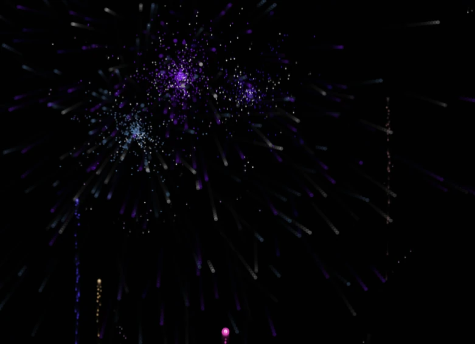

# Stunning Effects and Helper Tools for Canvas

<div align="center">
  <a href="./README.en.md">English</a>
  <a href="./README.md">中文</a>
</div>

<br />

<div align="center">
  
  
  
  
  
  
</div>

A feature-rich Canvas effects library that provides a variety of stunning visual effects and practical tools. It includes multiple animation effects like fireworks, starfields, water ripples, and a tech-style digital rain, as well as practical functions like image processing, screenshots, drawing, and image cutout.

## 🎬 Effect Preview

Please visit Github to view: https://github.com/beixiyo/jl-cvs

<div align="center">
  
  
  
  
</div>

<div align="center">
  
  
  
  
</div>

<div align="center">
  
  
  
</div>

## ✨ Features

- 🎨 **Rich Visual Effects**: Multiple animation effects like fireworks, starfields, water ripples, and tech-style digital rain.
- 🖼️ **Image Processing Tools**: Image cutout, smart selection, image to text, image fade, edge extraction, noise addition, watermarking, etc.
- 📊 **Image Data Processing**: ImageData processing algorithms like grayscale, contrast enhancement, binarization, and color replacement.
- 🎯 **Interactive Components**: Scratch cards, screenshot tools, drawing boards, etc.
- 🎬 **Video Processing**: Capture video frames, timeline navigation, batch frame extraction, etc.
- 📱 **Responsive Design**: Supports various screen sizes and devices.
- 🌙 **Theme Support**: Supports light and dark theme switching.
- 🔧 **Highly Configurable**: All effects offer a rich set of configuration options.
- 📚 **Complete Documentation**: All configurations have detailed JSDoc comments in Chinese. Please refer to the TS type files and documentation comments.

## Installation

```bash
npm i @jl-org/cvs
```

## Example Pages Directory

### 📋 Quick Navigation
- [🎆 Firework Effect (Firework)](#-firework-effect-firework) - `/firework`
- [🌍 Globe Sphere (GlobeSphere)](#-globe-sphere-globesphere) - `/globeSphere`
- [📐 Grid Effect (Grid)](#-grid-effect-grid) - `/grid`
- [🌀 Halftone Wave (HalftoneWave)](#-halftone-wave-halftonewave) - `/halftoneWave`
- [🖼️ Image to Fade (ImgToFade)](#️-image-to-fade-imgtofade) - `/imgToFade`
- [📝 Image to Text (ImgToTxt)](#-image-to-text-imgtotxt) - `/imgToTxt`
- [🎨 Infinite Canvas (NoteBoard)](#-infinite-canvas-noteboard) - `/noteBoard`
- [🎯 Scratch Card Effect (Scratch)](#-scratch-card-effect-scratch) - `/scratch`
- [📸 Screenshot Tool (ShotImg)](#-screenshot-tool-shotimg) - `/shotImg`
- [⭐ Starfield Scene (StarField)](#-starfield-scene-starfield) - `/starField`
- [💡 Smart Selection (SmartSelection)](#-smart-selection-smartselection) - `/smartSelection`
- [✂️ Cutout Tool (CutoutImg)](#️-cutout-tool-cutoutimg) - `/cutoutImg`
- [🔢 Tech Numbers (TechNum)](#-tech-numbers-technum) - `/techNum`
- [🌊 Water Ripple Effect (WaterRipple)](#-water-ripple-effect-waterripple) - `/waterRipple`
- [〰️ Wavy Lines (WavyLines)](#️-wavy-lines-wavylines) - `/wavyLines`
- [🖼️ Image Processing (ImgProcessing)](#️-image-processing-imgprocessing) - `/imgProcessing`
- [📊 Image Data Processing (ImgDataProcessing)](#-image-data-processing-imgdataprocessing) - `/imgDataProcessing`
- [🔍 Image Edge Detection (ImgEdgeDetection)](#-image-edge-detection-imgedgedetection) - `/imgEdgeDetection`
- [🎬 Capture Video Frame (CaptureVideoFrame)](#-capture-video-frame-capturevideoframe) - `/captureVideoFrame`

### Run Test Pages

```bash
# Install dependencies
pnpm install

# Build the core package
pnpm build
# Start the test page
pnpm test
```

Visit http://localhost:5173 to see all the test pages.

---

## 🎆 Firework Effect (Firework)

- **Live Demo**: https://jl-cvs.pages.dev/firework
- **Source Code**: [packages/test/src/views/firework/index.tsx](./packages/test/src/views/firework/index.tsx)


**Features**:
- Two types of fireworks: classic and two-stage explosion.
- Multiple color theme presets.
- Real-time parameter adjustment.
- Automatic playback and manual control.
- Rich visual effects.

**Firework Types**:
- 🎆 Classic Firework: Traditional firework explosion effect.
- 💥 Two-Stage Explosion Firework: More complex multi-layer explosion effect.

---

## 🌍 Globe Sphere (GlobeSphere)

- **Live Demo**: https://jl-cvs.pages.dev/globeSphere
- **Source Code**: [packages/test/src/views/globeSphere/index.tsx](./packages/test/src/views/globeSphere/index.tsx)


**Features**:
- 3D sphere rotation effect.
- Globe-style rendering.
- Interactive controls.
- Smooth animation transitions.

---

## ✂️ Cutout Tool (CutoutImg)

- **Live Demo**: https://jl-cvs.pages.dev/cutoutImg
- **Source Code**: [packages/test/src/views/cutoutImg/index.tsx](./packages/test/src/views/cutoutImg/index.tsx)


**Features**:
- **Brush Editing**: Supports brushing and erasing, with real-time preview of the cutout effect.
- **Parameter Adjustment**: Customizable brush thickness.
- **Interactive Control**: Supports undo, redo, drag, and clear canvas.
- **Image Export**: Download the edited image.

**How to Use**:
- Use the brush on the left canvas to paint the areas you want to keep.
- The right side will show a real-time preview of the cutout.
- Adjust the brush size or switch to drag mode using the toolbar.
- Download the image when finished.

---

## 💡 Smart Selection (SmartSelection)

- **Live Demo**: https://jl-cvs.pages.dev/smartSelection
- **Source Code**: [packages/test/src/views/smartSelection/index.tsx](./packages/test/src/views/smartSelection/index.tsx)


**Features**:
- **Smart Recognition**: Automatically identifies different regions in the image.
- **Hover Highlight**: Highlights selectable areas on mouse hover.
- **Click to Select**: Click to select or deselect a region.
- **Multi-Region Selection**: Supports selecting multiple independent regions simultaneously.

**How to Use**:
- Move the mouse over the image, and interactive areas will be highlighted.
- Click on a highlighted area to select it.
- Click again to deselect.

---

## 📐 Grid Effect (Grid)

- **Live Demo**: https://jl-cvs.pages.dev/grid
- **Source Code**: [packages/test/src/views/grid/index.tsx](./packages/test/src/views/grid/index.tsx)


**Features**:
- Dynamic grid background.
- Grid line animations.
- Adjustable grid density.
- Multiple style options.

---

## 🌀 Halftone Wave (HalftoneWave)

- **Live Demo**: https://jl-cvs.pages.dev/halftoneWave
- **Source Code**: [packages/test/src/views/halftoneWave/index.tsx](./packages/test/src/views/halftoneWave/index.tsx)


**Features**:
- Halftone-style wave animation.
- Dynamic dot matrix effect.
- Adjustable wave parameters.
- Multiple visual styles.

---

## 🖼️ Image to Fade (ImgToFade)

- **Live Demo**: https://jl-cvs.pages.dev/imgToFade
- **Source Code**: [packages/test/src/views/imgToFade/index.tsx](./packages/test/src/views/imgToFade/index.tsx)


**Features**:
- Image disintegrating fade effect.
- Multiple fade modes.
- Real-time preview.
- Customizable fade parameters.

---

## 📝 Image to Text (ImgToTxt)

- **Live Demo**: https://jl-cvs.pages.dev/imgToTxt
- **Source Code**: [packages/test/src/views/imgToTxt/index.tsx](./packages/test/src/views/imgToTxt/index.tsx)


**Features**:
- Converts images to ASCII characters.
- Multiple character set options.
- Adjustable conversion precision.
- Real-time conversion preview.

---

## 🎨 Infinite Canvas (NoteBoard)

- **Live Demo**: https://jl-cvs.pages.dev/noteBoard
- **Source Code**: [packages/test/src/views/noteBoard/index.tsx](./packages/test/src/views/noteBoard/index.tsx)


`NoteBoard` has been fully upgraded to an infinite canvas based on **world coordinates** and **viewport transformation**, offering extremely high performance and extensibility.

### ✨ Core Highlights

- ♾️ **True Infinite Canvas**: Achieved through viewport transformation, allowing for theoretically infinite zooming and panning.
- ⚡ **High-Performance Rendering**: Built-in **viewport culling** and **asynchronous rendering queue** ensure smoothness even with extremely large canvas content.
- 🎨 **Object-Oriented Shape System**: All graphics are independent objects, making it easy to manage and extend with new shapes.
- ✍️ **Rich Interactive Functions**: Supports brush, eraser, basic shape drawing, and **drag-and-drop movement** of any individual shape.
- 🧠 **Unified State Management**: Logic is separated through modules like `Renderer`, `Interaction`, and `Events`, with a reliable undo/redo feature.

### Version 3.0 Migration Guide

1. `draw` mode has been renamed to `brush`.
2. Events are now handled through an event system, e.g., `noteBoard.on('wheel', ({ scale }) => {})`, instead of being passed as `onXxx` in the constructor.
3. Added infinite canvas functionality, switching from CSS Transform to Canvas API for scaling.
4. Added the `addShape` method for freely adding graphics.
5. The `Mode` type has been renamed to `NoteBoardMode` for better semantics.

---

## 🎯 Scratch Card Effect (Scratch)

- **Live Demo**: https://jl-cvs.pages.dev/scratch
- **Source Code**: [packages/test/src/views/scratch/index.tsx](./packages/test/src/views/scratch/index.tsx)


**Features**:
- Realistic scratch card interaction experience.
- Customizable scratch thickness and style.
- Real-time calculation of scratch progress.
- Multiple preset configurations.
- Supports mouse and touch operations.

**Configuration Options**:
- **bg**: Scratch card background color.
- **lineWidth**: Scratch line thickness.
- **lineCap**: Line cap style (round/square/butt).
- **lineJoin**: Line join style (round/bevel/miter).

---

## 📸 Screenshot Tool (ShotImg)

- **Live Demo**: https://jl-cvs.pages.dev/shotImg
- **Source Code**: [packages/test/src/views/shotImg/index.tsx](./packages/test/src/views/shotImg/index.tsx)


**Features**:
- Drag to select a screenshot area.
- Supports image upload and preview.
- Real-time display of the selected area's dimensions.
- Supports multiple output formats (base64/blob).
- Adjustable overlay opacity.

**How to Use**:
- After uploading an image, drag on the canvas to select the screenshot area.
- Supports precise pixel-level selection.
- Export the selected area as an image.

---

## ⭐ Starfield Scene (StarField)

- **Live Demo**: https://jl-cvs.pages.dev/starField
- **Source Code**: [packages/test/src/views/starField/index.tsx](./packages/test/src/views/starField/index.tsx)


**Features**:
- Dynamic starfield background effect.
- Star twinkling and movement animations.
- Customizable star count, size, and color.
- Supports multiple color themes.
- Responsive canvas size adjustment.

**Configuration Options**:
- **starCount**: Number of stars (default 300).
- **sizeRange**: Star size range [min, max].
- **speedRange**: Movement speed range.
- **colors**: Array of star colors or a generator function.
- **backgroundColor**: Background color.
- **flickerSpeed**: Flicker frequency.

---

## 🔢 Tech Numbers (TechNum)

- **Live Demo**: https://jl-cvs.pages.dev/techNum
- **Source Code**: [packages/test/src/views/techNum/index.tsx](./packages/test/src/views/techNum/index.tsx)


**Features**:
- "The Matrix"-style digital rain effect.
- Customizable character set and colors.
- Multiple font choices.
- Adjustable flow speed and density.
- Classic green hacker theme.

**Configuration Options**:
- **colWidth**: Character column width.
- **fontSize**: Font size.
- **font**: Font type (supports monospaced fonts).
- **maskColor**: Overlay color (for fade-out effect).
- **gapRate**: Column reset probability (0-1).
- **durationMS**: Animation interval time.
- **getStr**: Custom character generator function.
- **getColor**: Custom color generator function.

---

## 🌊 Water Ripple Effect (WaterRipple)

- **Live Demo**: https://jl-cvs.pages.dev/waterRipple
- **Source Code**: [packages/test/src/views/waterRipple/index.tsx](./packages/test/src/views/waterRipple/index.tsx)


**Features**:
- Realistic water ripple diffusion animation.
- Adjustable ripple center position.
- Multiple preset effects (fast ripples, slow large ripples, color gradients).
- Supports custom stroke styles.
- Real-time parameter adjustment.

**Configuration Options**:
- **width/height**: Canvas dimensions.
- **xOffset/yOffset**: Ripple center offset.
- **lineWidth**: Ripple line width.
- **circleCount**: Number of concurrent ripple circles.
- **intensity**: Animation speed intensity.
- **strokeStyle**: Custom stroke style.

---

## 〰️ Wavy Lines (WavyLines)

- **Live Demo**: https://jl-cvs.pages.dev/wavyLines
- **Source Code**: [packages/test/src/views/wavyLines/index.tsx](./packages/test/src/views/wavyLines/index.tsx)


**Features**:
- Dynamic wavy lines background.
- Mouse interaction effect.
- Adjustable line density and spacing.
- Multiple color themes.
- Smooth animation transitions.

**Configuration Options**:
- **xGap/yGap**: Line spacing.
- **extraWidth/extraHeight**: Extra drawing area.
- **mouseEffectRange**: Mouse influence range.
- **strokeStyle**: Line color.

---

## 🖼️ Image Processing (ImgProcessing)

- **Live Demo**: https://jl-cvs.pages.dev/imgProcessing
- **Source Code**: [packages/test/src/views/imgProcessing/index.tsx](./packages/test/src/views/imgProcessing/index.tsx)

**Features**:
- **Noise Processing**: Adds a noise effect to the image, with adjustable noise intensity.
- **Watermark Addition**: Supports custom text watermarks, with settings for font size, spacing, color, and rotation angle.
- **Real-time Preview**: Displays the processed effect in real-time as parameters are adjusted.
- **Original Comparison**: Shows the original and processed images side-by-side.

**Configuration Options**:
- **noiseLevel**: Noise intensity (higher value means more noise).
- **watermarkText**: Watermark text content.
- **fontSize**: Watermark font size.
- **gap**: Watermark spacing.
- **color**: Watermark color (supports transparency).
- **rotate**: Watermark rotation angle.

---

## 📊 Image Data Processing (ImgDataProcessing)

- **Live Demo**: https://jl-cvs.pages.dev/imgDataProcessing
- **Source Code**: [packages/test/src/views/imgDataProcessing/index.tsx](./packages/test/src/views/imgDataProcessing/index.tsx)

**Features**:
- **Grayscale Processing**: Converts a color image to grayscale using a weighted algorithm.
- **Contrast Enhancement**: Adjusts image contrast to make details clearer.
- **Binarization Processing**: Converts the image to black and white, useful for scenarios like image recognition.
- **Color Replacement**: Replaces a specified color in the image with a target color.
- **Combined Processing**: Supports combining multiple algorithms.

**Configuration Options**:
- **contrastFactor**: Contrast enhancement factor (default 1.2).
- **binarizeThreshold**: Binarization threshold (0-255).
- **fromColor/toColor**: Source and target colors for color replacement.

---

## 🔍 Image Edge Detection (ImgEdgeDetection)

- **Live Demo**: https://jl-cvs.pages.dev/imgEdgeDetection
- **Source Code**: [packages/test/src/views/imgEdgeDetection/index.tsx](./packages/test/src/views/imgEdgeDetection/index.tsx)


**Features**:
- **Edge Extraction**: Uses the Sobel operator to detect image edges.
- **Threshold Adjustment**: Adjustable sensitivity threshold for edge detection.
- **Real-time Processing**: Shows edge detection results in real-time as parameters are adjusted.
- **Original Comparison**: Shows the original and edge-detected images side-by-side.

**Configuration Options**:
- **threshold**: Edge detection threshold (0-255, a smaller value detects more edges).

---

## 🎬 Capture Video Frame (CaptureVideoFrame)

- **Live Demo**: https://jl-cvs.pages.dev/captureVideoFrame
- **Source Code**: [packages/test/src/views/captureVideoFrame/index.tsx](./packages/test/src/views/captureVideoFrame/index.tsx)

**Features**:
- **Video Upload**: Supports drag-and-drop or click to upload video files.
- **Timeline Navigation**: Intuitive video timeline for precise frame positioning.
- **Batch Capture**: Supports capturing frames from multiple time points at once.
- **High-Quality Output**: Supports adjusting output image quality and format.
- **Download Function**: Download the captured frame images.

**How to Use**:
- Upload a video file or use the default demo video.
- Click or drag on the timeline to select the time points to capture.
- Supports millisecond-level frame positioning.
- Capture and download multiple frames in a batch.

---

## 📚 API Function Documentation

### All Categories
- **🖼️ Image Processing**: Noise, Watermark, Compose, Crop, Compress, Canvas Export, Download & Format Conversion
- **✂️ Cutout**: Mask Generation, Mask-based Cropping, Edge Smoothing
- **🔍 Image Edge**: Sobel Edge Detection
- **🎬 Capture Video Frame**: Supports Worker with Canvas fallback
- **🧪 ImageData Processing**: Grayscale, Contrast, Binarization, Color Replacement, Grayscale Array
- **🧰 Canvas Helpers**: Font, Clear, DPR, Coordinates, Pixel Access, Sizing Tools
- **🎨 Color Utilities**: RGBA Parsing, RGB/HEX Conversion, Opacity Handling
- **⚙️ General Utilities**: Debounce/Throttle, Deep Clone, Random Number, String, Undo/Redo List
- **🧩 SVG**: Checkerboard, Grid, Text
- **✨ Animation & Component Classes**: Grid, DotGrid, HalftoneWave, WavyLines, WaterRipple, Globe, StarField, Screenshot, NoteBoard, Firework, DigitalRain

---

### 🖼️ Image Processing
- **imgToNoise(img, level?)**: Adds noise to an image.
  - Use case: Quickly generate film grain or old photo texture.
  - Usage:
  ```ts
  const cvs = imgToNoise(img)
  document.body.appendChild(cvs)
  ```

- **waterMark({ text, fontSize, gap, color, rotate })**: Generates a tiled watermark.
  - Returns: `{ base64, size }`
  - Usage:
  ```css
  /* CSS Example */
  background-image: url(${base64})
  background-size: ${size}px ${size}px
  ```

- **composeImg([{ src, left, top }], width, height)**: Composites multiple images on a Canvas and exports as base64.
  - Usage:
  ```ts
  const base64 = await composeImg([
    { src: '/bg.png' },
    { src: fileBlob, left: 40, top: 60 },
  ], 800, 600)
  ```

- **cutImg(img, opts, resType?)**: Crops a region of an image, supports exporting as base64/blob.
  - Key options: `x y width height mimeType quality`

- **compressImg(img, resType?, quality?, mimeType?)**: Compresses an image.
  - Only `image/jpeg | image/webp` support lossy compression.

- **getCvsImg(cvs, resType?, mimeType?, quality?)**: Exports a Canvas as base64/blob.

- **Download & Format Conversion**:
  - `downloadByData(data, filename)`, `downloadByUrl(url, filename)`
  - `blobToBase64(blob)`, `base64ToBlob(base64, mimeType?)`
  - `urlToBlob(url)`, `getImg(src)`

---

### ✂️ Cutout
- **cutoutImgToMask(imgUrl, replaceColor, opts?)**: Converts a cutout to a mask (replaces non-transparent areas with a specified color).
  - Options: `smoothEdge`, `smoothRadius`, `alphaThreshold`, `ignoreAlpha`, `handleAlpha`.
  - Suitable for generating solid-color masks for download/overlay.

- **cutoutImg(original, mask)**: Crops the original image based on the opaque areas of a mask image.
  - Uses `globalCompositeOperation`, outputs a transparent PNG base64.

- **cutoutImgSmoothed(original, mask, { blurRadius, featherAmount })**: Pixel-level smooth edge cropping.
  - Outputs `ImageData`.

---

### 🔍 Image Edge
- **getImgEdge(source, { threshold }?)**: Extracts edges using the Sobel operator.
  - `source` can be an image URL or `ImageData`.
  - Returns `ImageData`.

---

### 🎬 Capture Video Frame
- **captureVideoFrame(fileOrUrl, time, resType?, options?)**: Captures a frame at a specified time.
  - Auto-selection: Supports `ImageCapture` with a Worker, falls back to Canvas if unavailable.
  - `time` can be a number or an array, `resType` supports `'base64' | 'blob'`.
  - Example: Batch capture frames and export as base64.
  ```ts
  const frames = await captureVideoFrame(file, [1, 2, 8], 'base64', {
    quality: 0.6
  })
  ```

---

### 🧪 ImageData Processing
- **adaptiveGrayscale(imageData)**: Weighted grayscale conversion.
- **enhanceContrast(imageData, factor=1.2)**: Contrast enhancement.
- **adaptiveBinarize(imageData, threshold=128)**: Binarization (recommended after grayscale and contrast enhancement).
- **changeImgColor(imgOrUrl, fromColor, toColor, opts?)**: Replaces a specified color.
  - Allows custom `isSameColor(pixel, x, y, index)`.
  - Example: Replace pure red with semi-transparent blue.
  ```ts
  const { base64 } = await changeImgColor('/a.png', '#ff0000', 'rgba(0, 0, 255, .5)')
  ```
- **getGrayscaleArray(imageData)**: Gets a grayscale array `Uint8Array`.

> Note: `pickImgArea` and `invertImgArea` from old documentation have been removed (code does not exist).

---

### 🧰 Canvas Helpers
- Basic:
  - **setFont(ctx, { size, family, weight, textAlign, textBaseline, color })**
  - **clearAllCvs(ctx, canvas)**
  - **getDPR(max=2)**
  - **timeFunc(str) / genTimeFunc(str)**: Time function generator (easing/beat).
- Sizing/Coordinates:
  - **getWinWidth() / getWinHeight()**, **calcCoord(r, deg)**
  - **createCvs(width?, height?, options?) => { cvs, ctx }**
- Pixel/Data:
  - **getImgData(imgOrUrl)**, **getImgDataIndex(x, y, width)**
  - **getPixel(x, y, imgData)**, **parseImgData(imgData)**, **fillPixel(ctx, x, y, color)**
  - **eachPixel(imgData, cb)**, **scaleImgData(imgData, scaleX, scaleY)**

---

### 🎨 Color Utilities
- **getColorInfo(color)**: Parses RGBA.
- **getColor() / getColorArr(size)**: Random color/array.
- **hexColorToRaw(color)**: Completes HEX length (`#000 -> #000000`).
- **hexToRGB(color)**, **rgbToHex(color)**
- **lightenColor(color, strength?)**: Adjusts transparency.
- **colorAddOpacity(color, opacity?)**: Adds opacity to a color (returns HEX with alpha).

### ⚙️ General Utilities
- **debounce(fn, wait)** / **throttle(fn, wait)**
- **deepClone(obj)**, **excludeKeys(obj, keys)**
- **getRandomNum(min, max)**, **randomStr(len)**, **numFixed(num, digits)**
- **UnRedoLinkedList** / **createUnReDoList**: Undo/redo data structure.

---

### 🧩 SVG
- **genSvgBoard(width?, height?, gap?, opts?)**: Returns `{ svg, g }`.
- **genBoard(width?, height?, gap?, opts?)**: Returns a checkerboard `g`.
- **genSvg(viewBox?, width?, height?)**: Creates an `svg` element.
- **genGrid(width?, height?, gap?, opts?)**: Creates a grid `path`.
- **genGridPath(width?, height?, gap?, needHorizontal?, needVertical?)**: Generates a `d` attribute.
- **genTextArr(width?, height?, gap?, opts?)**: Batch generates text with coordinates.

---

### ✨ Animation & Component Classes
- **Grid(canvas, options?)**: Dynamic grid background, supports mouse highlight, glow, and dashed lines.
- **DotGrid(canvas, options?)**: Dot matrix grid background with gradient highlight.
- **HalftoneWave(canvas, options?)**: Halftone wave animation.
- **WavyLines({ canvas, ... })**: Noise-driven wavy lines.
- **WaterRipple(options?)**: Water ripple diffusion.
  ```ts
  const ripple = new WaterRipple({ circleCount: 10 })
  document.body.appendChild(ripple.canvas)
  ```
- **GlobeSphere(canvas, options?)**: Dot matrix sphere.
- **StarField(canvas, options?)**: Starfield background.
- **imgToFade(bgCanvas, opts)**: Image disintegrating effect.
- **imgToTxt(options)**: Image/video to text rendering.
- **ShotImg(canvas, img?, opacity?)**: Screenshot tool.
  ```ts
  const s = new ShotImg(cvs, img)
  const shot = await s.getShotImg('base64')
  ```
- **NoteBoard(options)** / **NoteBoardWithBase64(options)**: Drawing board (shapes/undo-redo/zoom-pan).
- **createScratch(canvas, opts?)**: Scratch card interaction.
- **createFirework(canvas, opts?)** / **createFirework2(canvas, opts)**: Firework effects.
- **createTechNum(options)**: Tech-style digital rain.
