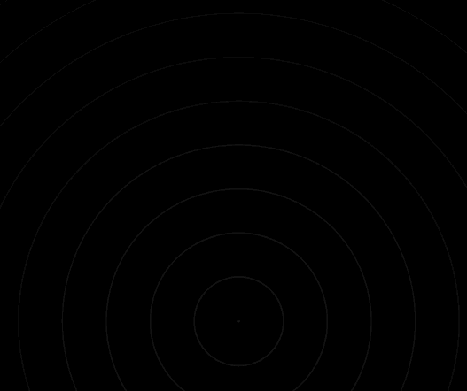
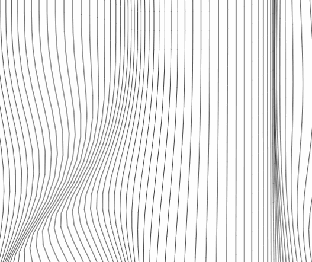
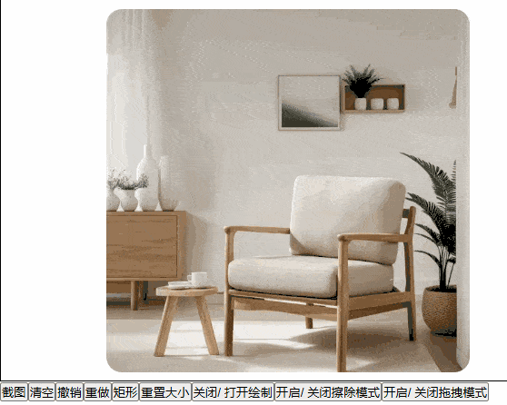

# Canvas 的各种令人惊叹效果，以及辅助工具

<p align="center">
  
  
  
</p>

一个功能丰富的 Canvas 效果库，提供了多种令人惊叹的视觉效果和实用工具。包含烟花、星空、水波纹、科技数字雨等多种动画效果，以及图像处理、截图、绘图等实用功能。

## 🎬 效果预览

<div align="center">
  
  
  
  
</div>

<div align="center">
  
  
  
  
</div>

## ✨ 特性

- 🎨 **丰富的视觉效果**：烟花、星空、水波纹、科技数字雨等多种动画效果
- 🖼️ **图像处理工具**：图像转文字、图像淡化、抠图、边缘提取等
- 🎯 **交互式组件**：刮刮卡、截图工具、绘图画板等
- 📱 **响应式设计**：支持多种屏幕尺寸和设备
- 🌙 **主题支持**：支持明暗主题切换
- 🔧 **高度可配置**：所有效果都提供丰富的配置选项
- 📚 **完整文档**：所有配置都有中文的文档注释，详见 TS 类型文件和文档注释

## 安装

```bash
npm i @jl-org/cvs
```

## 示例页面目录

### 📋 快速导航
- [🎆 烟花效果 (Firework)](#-烟花效果-firework) - `/firework`
- [🌍 球体地球仪 (GlobeSphere)](#-球体地球仪-globesphere) - `/globeSphere`
- [📐 网格效果 (Grid)](#-网格效果-grid) - `/grid`
- [🌀 半调波浪 (HalftoneWave)](#-半调波浪-halftonewave) - `/halftoneWave`
- [🖼️ 图像灰飞烟灭 (ImgToFade)](#️-图像灰飞烟灭-imgtofade) - `/imgToFade`
- [📝 图像转文字 (ImgToTxt)](#-图像转文字-imgtotxt) - `/imgToTxt`
- [🎨 图像编辑画板 (NoteBoard)](#-图像编辑画板-noteboard) - `/noteBoard`
- [🎯 刮刮卡效果 (Scratch)](#-刮刮卡效果-scratch) - `/scratch`
- [📸 截图工具 (ShotImg)](#-截图工具-shotimg) - `/shotImg`
- [⭐ 星空场景 (StarField)](#-星空场景-starfield) - `/starField`
- [🔢 科技数字 (TechNum)](#-科技数字-technum) - `/techNum`
- [🌊 水波纹效果 (WaterRipple)](#-水波纹效果-waterripple) - `/waterRipple`
- [〰️ 波浪线条 (WavyLines)](#️-波浪线条-wavylines) - `/wavyLines`

### 运行测试页面

```bash
# 安装依赖
pnpm install

# 启动测试页面
pnpm test
```

访问 `http://localhost:5173` 即可查看所有测试页面

## 项目结构

```
├── docAssets/        # 文档资源文件（效果预览图、演示动图）
├── packages/
│   ├── jl-cvs/       # 主要组件库
│   │   └── src/      # 组件源码
│   └── test/         # 测试页面
│       └── src/
│           └── views/ # 所有测试页面
└── README.md         # 项目文档
```

---

## 🎆 烟花效果 (Firework)

**访问路径**: `/firework`
**文件位置**: `packages/test/src/views/firework/index.tsx`


**功能特性**:
- 两种烟花类型：经典烟花和二段爆炸烟花
- 多种颜色主题预设
- 实时参数调整
- 自动播放和手动控制
- 丰富的视觉效果

**烟花类型**:
- 🎆 经典烟花：传统的烟花爆炸效果
- 💥 二段爆炸烟花：更复杂的多层爆炸效果

## 🌍 球体地球仪 (GlobeSphere)

**访问路径**: `/globeSphere`
**文件位置**: `packages/test/src/views/globeSphere/index.tsx`


**功能特性**:
- 3D 球体旋转效果
- 地球仪样式渲染
- 交互式控制
- 平滑动画过渡

## 📐 网格效果 (Grid)

**访问路径**: `/grid`
**文件位置**: `packages/test/src/views/grid/index.tsx`


**功能特性**:
- 动态网格背景
- 网格线条动画
- 可调节网格密度
- 多种样式选项

## 🌀 半调波浪 (HalftoneWave)

**访问路径**: `/halftoneWave`
**文件位置**: `packages/test/src/views/halftoneWave/index.tsx`


**功能特性**:
- 半调风格的波浪动画
- 动态点阵效果
- 可调节波浪参数
- 多种视觉样式

## 🖼️ 图像灰飞烟灭 (ImgToFade)

**访问路径**: `/imgToFade`
**文件位置**: `packages/test/src/views/imgToFade/index.tsx`


**功能特性**:
- 图像渐变淡化效果
- 多种淡化模式
- 实时预览
- 自定义淡化参数

## 📝 图像转文字 (ImgToTxt)

**访问路径**: `/imgToTxt`
**文件位置**: `packages/test/src/views/imgToTxt/index.tsx`


**功能特性**:
- 将图像转换为 ASCII 字符
- 多种字符集选择
- 可调节转换精度
- 实时转换预览

## 🎨 图像编辑画板 (NoteBoard)

**访问路径**: `/noteBoard`
**文件位置**: `packages/test/src/views/noteBoard/index.tsx`




**功能特性**:
- 功能完整的 Canvas 画板组件
- 多种绘图模式：绘制、擦除、拖拽、图形绘制
- 支持撤销/重做操作
- 图片上传和背景设置
- 分层导出功能
- 画笔样式自定义

**绘图模式**:
- ✏️ 绘制：自由绘制线条
- 🧽 擦除：擦除已绘制内容
- ✋ 拖拽：拖拽移动画布
- ⬜ 矩形：绘制矩形图形
- ⭕ 圆形：绘制圆形图形
- ➡️ 箭头：绘制箭头图形

## 🎯 刮刮卡效果 (Scratch)

**访问路径**: `/scratch`
**文件位置**: `packages/test/src/views/scratch/index.tsx`


**功能特性**:
- 真实的刮刮卡交互体验
- 可自定义刮涂粗细和样式
- 实时刮开进度计算
- 多种预设配置
- 支持鼠标和触摸操作

**配置选项**:
- **bg**: 刮刮卡背景色
- **lineWidth**: 刮涂线条粗细
- **lineCap**: 线条端点样式 (round/square/butt)
- **lineJoin**: 线条连接样式 (round/bevel/miter)

## 📸 截图工具 (ShotImg)

**访问路径**: `/shotImg`
**文件位置**: `packages/test/src/views/shotImg/index.tsx`


**功能特性**:
- 拖拽选择截图区域
- 支持图片上传和预览
- 实时显示选择区域尺寸
- 支持多种输出格式 (base64/blob)
- 蒙层透明度可调节

**使用方法**:
- 上传图片后，在画布上拖拽选择截图区域
- 支持精确的像素级选择
- 可导出选中区域为图片

## ⭐ 星空场景 (StarField)

**访问路径**: `/starField`
**文件位置**: `packages/test/src/views/starField/index.tsx`


**功能特性**:
- 动态星空背景效果
- 星星闪烁和移动动画
- 可自定义星星数量、大小、颜色
- 支持多种颜色主题
- 响应式画布尺寸调整

**配置选项**:
- **starCount**: 星星数量 (默认 300)
- **sizeRange**: 星星大小范围 [min, max]
- **speedRange**: 移动速度范围
- **colors**: 星星颜色数组或生成函数
- **backgroundColor**: 背景颜色
- **flickerSpeed**: 闪烁频率

## 🔢 科技数字 (TechNum)

**访问路径**: `/techNum`
**文件位置**: `packages/test/src/views/techNum/index.tsx`


**功能特性**:
- 《黑客帝国》风格数字雨效果
- 可自定义字符集和颜色
- 多种字体选择
- 流动速度和密度可调
- 经典绿色黑客主题

**配置选项**:
- **colWidth**: 字符列宽度
- **fontSize**: 字体大小
- **font**: 字体类型 (支持等宽字体)
- **maskColor**: 蒙层颜色 (用于淡出效果)
- **gapRate**: 列重置概率 (0-1)
- **durationMS**: 动画间隔时间
- **getStr**: 自定义字符生成函数
- **getColor**: 自定义颜色生成函数

## 🌊 水波纹效果 (WaterRipple)

**访问路径**: `/waterRipple`
**文件位置**: `packages/test/src/views/waterRipple/index.tsx`


**功能特性**:
- 逼真的水波纹扩散动画
- 可调节波纹中心位置
- 多种预设效果 (快速波纹、慢速大波纹、彩色渐变)
- 支持自定义描边样式
- 实时参数调整

**配置选项**:
- **width/height**: 画布尺寸
- **xOffset/yOffset**: 波纹中心偏移量
- **lineWidth**: 波纹线条宽度
- **circleCount**: 同时显示的波纹圈数
- **intensity**: 动画速度强度
- **strokeStyle**: 自定义描边样式

## 〰️ 波浪线条 (WavyLines)

**访问路径**: `/wavyLines`
**文件位置**: `packages/test/src/views/wavyLines/index.tsx`


**功能特性**:
- 动态波浪线条背景
- 鼠标交互效果
- 可调节线条密度和间距
- 多种颜色主题
- 平滑的动画过渡

**配置选项**:
- **xGap/yGap**: 线条间距
- **extraWidth/extraHeight**: 额外绘制区域
- **mouseEffectRange**: 鼠标影响范围
- **strokeStyle**: 线条颜色

---

## 📚 API 函数文档

### 全部函数

- [图像处理](#图像处理)
- [抠图](#抠图)
- [提取图像边缘](#提取图像边缘)
- [截取视频某一帧](#截取视频某一帧)
- [ImageData 处理，灰度、对比度、二值化等](#imagedata-处理)
<br />

- [辅助函数](#canvas-辅助函数)
- [颜色处理](#颜色处理)
- [svg](#svg)

---

### 图像处理

```ts
/**
 * 图片噪点化
 * @param img 图片
 * @param level 噪点等级，默认 100
 */
export declare function imgToNoise(img: HTMLImageElement, level?: number): HTMLCanvasElement

/**
 * 添加水印
 * 返回 base64 和图片大小，你可以用 CSS 设置上
 * @example
 * background-image: url(${base64});
 * background-size: ${size}px ${size}px;
 */
export declare function waterMark({ fontSize, gap, text, color, rotate }: WaterMarkOpts): {
  base64: string
  size: number
}

/**
 * 用 Canvas 层层叠加图片，支持 base64 | blob
 */
export declare function composeImg(srcs: Array<{
  src: string | Blob
  left?: number
  top?: number
  setImg?: (img: HTMLImageElement) => void
}>, width: number, height: number): Promise<string>

/**
 * 裁剪图片指定区域，可设置缩放，返回 base64 | blob
 * @param img 图片
 * @param opts 配置
 * @param resType 需要返回的文件格式，默认 `base64`
 */
export declare function cutImg<T extends TransferType = 'base64'>(img: HTMLImageElement, opts?: CutImgOpts, resType?: T): Promise<HandleImgReturn<T>>

/**
 * 压缩图片
 * @param img 图片
 * @param resType 需要返回的文件格式，默认 `base64`
 * @param quality 压缩质量，默认 0.5
 * @param mimeType 图片类型，默认 `image/webp`。`image/jpeg | image/webp` 才能压缩
 * @returns base64 | blob
 */
export declare function compressImg<T extends TransferType = 'base64'>(img: HTMLImageElement, resType?: T, quality?: number, mimeType?: 'image/jpeg' | 'image/webp'): Promise<HandleImgReturn<T>>

/**
 * 把 canvas 上的图像转成 base64 | blob
 * @param cvs canvas
 * @param resType 需要返回的文件格式，默认 `base64`
 * @param mimeType 图片的 MIME 格式
 * @param quality 压缩质量
 */
export declare function getCvsImg<T extends TransferType = 'base64'>(cvs: HTMLCanvasElement, resType?: T, mimeType?: string, quality?: number): Promise<HandleImgReturn<T>>

/**
 * Blob 转 Base64
 */
export declare function blobToBase64(blob: Blob): Promise<string>

/**
 * Base64 转 Blob
 * @param base64Str base64
 * @param mimeType 文件类型，默认 application/octet-stream
 */
export declare function base64ToBlob(base64Str: string, mimeType?: string): Blob

/**
 * 把 http url 转 blob
 */
export declare function urlToBlob(url: string): Promise<Blob>

/**
 * 判断图片的 src 是否可用，可用则返回图片
 * @param src 图片
 * @param setImg 图片加载前执行的回调函数
 */
export declare const getImg: (src: string, setImg?: ((img: HTMLImageElement) => void) | undefined) => Promise<false | HTMLImageElement>
```

---

### 抠图
```ts
/**
 * 抠图转遮罩（把图片的非透明区域，换成指定颜色）
 * @param imgUrl 图片
 * @param replaceColor 替换的颜色
 */
export declare function cutoutImgToMask(imgUrl: string, replaceColor: string, { smoothEdge, smoothRadius, alphaThreshold, ignoreAlpha }?: CutImgToMaskOpts): Promise<{
  base64: string
  imgData: ImageData
}>

/**
 * 传入一张原始图片和一张遮罩图片，将遮罩图不透明的区域提取出来。
 * 使用 **globalCompositeOperation** 实现
 *
 * @param originalImageSource 原图
 * @param maskImageSource 遮罩图
 */
export declare function cutoutImg(originalImageSource: string | HTMLImageElement, maskImageSource: string | HTMLImageElement): Promise<string>

/**
 * 传入一张原始图片和一张遮罩图片，将遮罩图不透明的区域提取出来，并对提取出的区域进行平滑处理。
 * 遍历处理每个像素实现
 *
 * @param originalImg 原图
 * @param maskImg 遮罩图
 */
export declare function cutoutImgSmoothed(originalImg: string, maskImg: string, { blurRadius, featherAmount, }?: CutoutImgOpts): Promise<ImageData>
```

---

### 提取图像边缘
```ts
/**
 * 提取图片边缘
 * @param source 图片URL或ImageData对象
 * @param options 配置项
 */
export declare function getImgEdge(source: string | ImageData, options?: {
  threshold?: number
}): Promise<ImageData>
```

---

### 截取视频某一帧

```ts
/**
 * 示例，使用 Web Worker 截取视频 1、2、100 秒的图片
 */
const srcs = await captureVideoFrame(file, [1, 2, 100], 'base64', {
  quality: 0.5,
})

/**
 * 截取视频某一帧图片，大于总时长则用最后一秒。
 * 如果浏览器支持 ImageCapture，则使用 Worker 截取帧，否则降级为截取 Canvas。
 * @param fileOrUrl 文件或者链接
 * @param time 时间，可以是数组
 * @param resType 返回类型
 */
export declare function captureVideoFrame<N extends number | number[], T extends TransferType = 'base64'>(fileOrUrl: File | string, time: N, resType?: T, options?: Options): Promise<N extends number ? HandleImgReturn<T> : HandleImgReturn<T>[]>
```

---

### ImageData 处理
```ts
/**
 * 灰度化算法：加权灰度化
 * @returns
 */
export declare const adaptiveGrayscale: (imageData: ImageData) => ImageData

/**
 * 对比度增强
 * @param factor 因数，默认 1.2
 * @returns
 */
export declare const enhanceContrast: (imageData: ImageData, factor?: number) => ImageData

/**
 * 二值化处理，请先调用
 * - adaptiveGrayscale
 * - enhanceContrast
 *
 * 最后再调用此函数，以获得最好的图像效果
 *
 * @param threshold 阈值边界，默认 128
 * @returns
 */
export declare const adaptiveBinarize: (imageData: ImageData, threshold?: number) => ImageData

/**
 * 传入一张参考图，返回另一张图片，其中参考图的非透明区域将被裁剪掉
 * @param rawImg 原图
 * @param referenceImg 参考图
 */
export declare function pickImgArea(rawImg: string, referenceImg: string): Promise<ImageData>

/**
 * 传入一张参考图，返回另一张图片，其中参考图的透明区域将被裁剪掉
 * @param rawImg 原图
 * @param referenceImg 参考图
 */
export declare function invertImgArea(rawImg: string, referenceImg: string): Promise<ImageData>
```

---

### Canvas 辅助函数
```ts
/**
 * 设置字体，默认居中
 */
export declare function setFont(ctx: CanvasRenderingContext2D, options: CtxFontOpt): void

/** 清除 canvas 整个画布的内容 */
export declare function clearAllCvs(ctx: CanvasRenderingContext2D, canvas: HTMLCanvasElement): void

/**
 * 根据半径和角度获取 DOM 坐标
 * @param r 半径
 * @param deg 角度
 */
export declare function calcCoord(r: number, deg: number): readonly [number, number]

/**
 * 创建一个指定宽高的画布
 * @param width 画布的宽度
 * @param height 画布的高度
 * @param options 上下文配置
 * @returns 包含画布和上下文的对象
 */
export declare function createCvs(width?: number, height?: number, options?: CanvasRenderingContext2DSettings): {
  cvs: HTMLCanvasElement
  ctx: CanvasRenderingContext2D
}

/**
 * 取出 `canvas` 用一维数组描述的颜色中，某个坐标的`RGBA`数组
 * ## 注意坐标从 0 开始
 * @param x 宽度中的第几列
 * @param y 高度中的第几行
 * @param imgData ctx.getImageData 方法获取的 ImageData
 * @returns `RGBA`数组
 */
export declare function getPixel(x: number, y: number, imgData: ImageData): Pixel

/**
 * 美化 ctx.getImageData.data 属性
 * 每一行为一个大数组，每个像素点为一个小数组
 * @param imgData ctx.getImageData 方法获取的 ImageData
 */
export declare function parseImgData(imgData: ImageData): Pixel[][]

/** 给 canvas 某个像素点填充颜色的函数 */
export declare function fillPixel(ctx: CanvasRenderingContext2D, x: number, y: number, color: string): void
```

---

### 颜色处理
```ts
/**
 * 把颜色提取出 RGBA
 * @example
 * ```ts
 * getColorInfo('rgba(0, 0, 0, 1)')
 * getColorInfo('rgb(0, 0, 0)')
 *
 * getColorInfo('#fff')
 * getColorInfo('#fff1')
 * ```
 */
export declare function getColorInfo(color: string): {
  r: number
  g: number
  b: number
  a: number
}

/** 获取十六进制随机颜色 */
export declare function getColor(): string

/** 随机十六进制颜色数组 */
export declare function getColorArr(size: number): string[]

/**
## 把十六进制颜色转成 原始长度的颜色
  - #000 => #000000
  - #000f => #000000ff
 */
export declare function hexColorToRaw(color: string): string

/** 十六进制 转 RGB */
export declare function hexToRGB(color: string): string

/** RGB 转十六进制 */
export declare function rgbToHex(color: string): string | undefined

/**
 * 淡化颜色透明度，支持 `RGB` 和 `十六进制`
 * @param color rgba(0, 239, 255, 1)
 * @param strength 淡化的强度
 * @returns 返回 RGBA 类似如下格式的颜色 `rgba(0, 0, 0, 0.1)`
 */
export declare function lightenColor(color: string, strength?: number): string

/**
 * 颜色添加透明度，支持 `RGB` 和 `十六进制`
 * @param color 颜色
 * @param opacity 透明度
 * @returns 返回十六进制 类似如下格式的颜色 `#ffffff11`
 */
export declare function colorAddOpacity(color: string, opacity?: number): string
```

---

### svg
> 下面的函数，其实 *genSvgBoard* | *genBoard*，就够用了，其他暴露的函数，仅仅是他们内部的实现
```ts
/**
 * 生成 svg 棋盘
 * @param width 宽度
 * @param height 高度
 * @param gap 间隔
 * @param opts 文字配置选项
 */
export declare function genSvgBoard(width?: number, height?: number, gap?: number, opts?: Opts): {
  svg: SVGSVGElement
  g: SVGGElement
}

/** 生成棋盘的 path 和 text 元素 */
export declare function genBoard(width?: number, height?: number, gap?: number, opts?: Opts): SVGGElement

/** 生成 svg */
export declare function genSvg(viewBox?: string, width?: number, height?: number): SVGSVGElement

/** 生成 svg path 网格 */
export declare function genGrid(width?: number, height?: number, gap?: number, opts?: GridOpts): SVGPathElement

/**
 * 生成网格路径
 * @param width 宽度
 * @param height 高度
 * @param gap 间隔
 * @param needHorizontal 需要水平线 默认 true
 * @param needVertical 需要垂直线 默认 true
 * @returns svg path 元素的路径 d
 */
export declare function genGridPath(width?: number, height?: number, gap?: number, needHorizontal?: boolean, needVertical?: boolean): string

/** 生成 svg 文字数组 */
export declare function genTextArr(width?: number, height?: number, gap?: number, opts?: FontOpts): SVGTextElement[]
```
