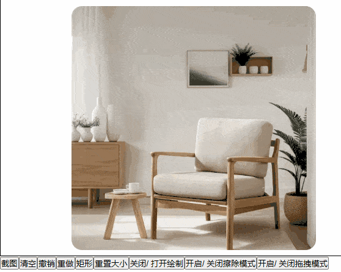
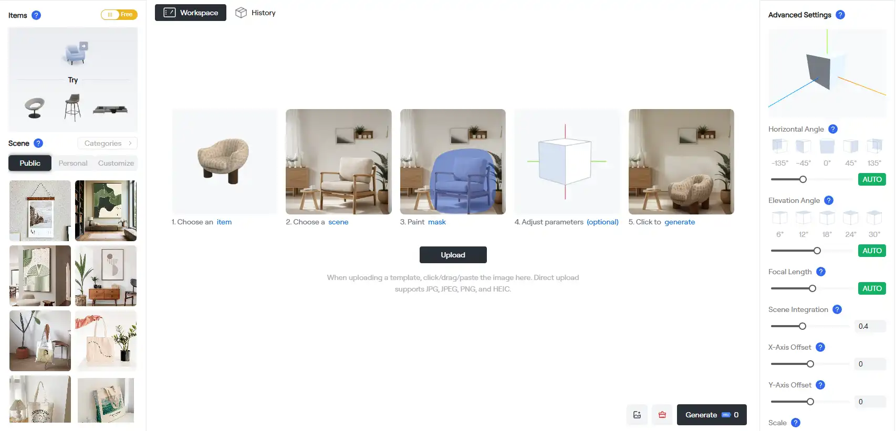

# Canvas 的各种令人惊叹效果，以及辅助工具

## 安装

```bash
npm i @jl-org/cvs
```

**所有配置都有中文的文档注释**

**配置详见 TS 类型文件和文档注释**

## 全部函数

- [图像编辑画板，可绘画、擦除、缩放、撤销、重做、绘制形状等](#图像编辑画板)
<br />

- [文本绘制 (图片 | 视频 | 文字)](#文本绘制-图片--视频--文字)
- [闪烁星空](#闪烁星空)
- [网格](#网格)
- [小点网格](#小点网格)
- [旋转球体](#旋转球体)

<br />

- [动感波浪](#动感波浪)
- [跟随鼠标的波浪线条](#跟随鼠标的波浪线条)

<br />

- [放烟花](#放烟花)
- [二段爆炸的烟花](#二段爆炸的烟花)
- [图片灰飞烟灭效果](#图片灰飞烟灭效果)
<br />

- [拖拽区域截图](#拖拽区域截图)
- [水波纹](水波纹)
- [刮刮乐](#刮刮乐)
- [黑客科技数字墙](#黑客科技数字墙)
<br />

- [图像处理](#图像处理)
- [抠图](#抠图)
- [提取图像边缘](#提取图像边缘)
- [截取视频某一帧](#截取视频某一帧)
- [ImageData 处理，灰度、对比度、二值化等](#ImageData-处理)
<br />

- [辅助函数](#canvas-辅助函数)
- [颜色处理](#颜色处理)
- [svg](#svg)

---


## 示例用到的辅助函数
```ts
function genBtn(txt: string, cb: Function) {
  const btn = document.createElement('button')
  btn.innerText = txt

  btn.onclick = cb as any
  document.body.appendChild(btn)
}
```

---


## 图像编辑画板

**请到 Github 查看图片示例**

https://github.com/beixiyo/jl-cvs



```ts
import { NoteBoard } from '@jl-org/cvs'


const WIDTH = 600
const HEIGHT = 400
const LINE_WIDTH = 30

/**
 * 图片画板 =========================================
 */
const el = document.createElement('div')
el.style.width = `${WIDTH}px`
el.style.height = `${HEIGHT}px`
el.style.border = '1px solid'
document.body.appendChild(el)

const board = new NoteBoard({
  el,
  width: WIDTH,
  height: HEIGHT,
  lineWidth: LINE_WIDTH,
  strokeStyle: '#409eff55',
  globalCompositeOperation: 'xor',

  onWheel({ scale }) {
    console.log('onWheel 同步笔刷大小')
    if (scale < 1) return

    board.setStyle({
      lineWidth: LINE_WIDTH / scale
    })
    board.setCursor()
  },
})

/**
 * 居中绘制图片，并自动拉伸大小
 */
board.drawImg(
  'yourUrl',
  {
    center: true,
    autoFit: true,
  },
)


/**
 * 按钮 =========================================
 */
genBtn('单独导出', async () => {
  const src = await board.exportImg({ exportOnlyImgArea: true })
  const imgEl = new Image()
  imgEl.src = src

  const mask = await board.exportMask({ exportOnlyImgArea: true })
  const maskImgEl = new Image()
  maskImgEl.src = mask

  document.body.appendChild(imgEl)
  document.body.appendChild(maskImgEl)
})

genBtn('导出所有', async () => {
  const src = await board.exportAllLayer({ exportOnlyImgArea: true })
  const imgEl = new Image()
  imgEl.src = src

  document.body.appendChild(imgEl)
})

genBtn('清空', () => {
  board.clear()
})

genBtn('撤销', () => {
  board.undo()
})
genBtn('重做', () => {
  board.redo()
})
genBtn('重置大小', () => {
  board.resetSize()
})

genBtn('矩形', () => {
  board.setShapeStyle({
    fillStyle: '#fff',
    lineWidth: 2,
    strokeStyle: '#409eff',
  })
  board.setMode('rect')
})

genBtn('圆形', () => {
  board.setShapeStyle({
    fillStyle: '#f405',
    lineWidth: 2,
    strokeStyle: '#000',
  })
  board.setMode('circle')
})

genBtn('关闭/ 打开绘制', () => {
  board.mode === 'draw'
    ? board.setMode('none')
    : board.setMode('draw')
})

genBtn('开启/ 关闭擦除模式', () => {
  board.mode === 'erase'
    ? board.setMode('none')
    : board.setMode('erase')
})

genBtn('开启/ 关闭拖拽模式', () => {
  board.mode === 'drag'
    ? board.setMode('none')
    : board.setMode('drag')
})
```

使用它开发的图像编辑器，[PhotoG](https://photog.art)




**如需使用旧版，请使用 *NoteBoardWithBase64***

---


## 文本绘制 (图片 | 视频 | 文字)
```ts
import { imgToTxt } from '@jl-org/cvs'

const replaceText = '6';
/** 绘制文字 */
(function () {
  const cvs = document.createElement('canvas')
  document.body.appendChild(cvs)

  imgToTxt({
    canvas: cvs,
    opts: {
      txt: '哎呀你干嘛',
      txtStyle: {
        family: '楷体',
      }
    },
    replaceText,
  })
})();

/** 绘制图片 */
(function () {
  const cvs = document.createElement('canvas')
  document.body.appendChild(cvs)

  imgToTxt({
    canvas: cvs,
    gap: 8,
    isGray: false,
    opts: {
      img: './assets/ji_ni_tai_mei.png',
      height: 500,
    },
    replaceText
  })
})();

/** 绘制视频 */
(function () {
  const cvs = document.createElement('canvas')
  document.body.appendChild(cvs)

  imgToTxt({
    canvas: cvs,
    gap: 10,
    isGray: false,
    opts: {
      video: './assets/ji_ni_tai_mei.mp4',
      height: 500,
    },
    replaceText
  })
})()
```

---

## 闪烁星空

```ts
import { StarField } from '@jl-org/cvs'

Object.assign(document.body.style, {
  overflow: 'hidden',
  margin: 0,
  padding: 0,
})

const canvas = document.createElement('canvas')
document.body.appendChild(canvas)
const starField = new StarField(canvas, {
  flickerSpeed: 0.02
})

window.addEventListener('resize', () => {
  starField.onResize(window.innerWidth, window.innerHeight)
})
```

---

## 网格

```ts
import { Grid } from '@jl-org/cvs'

const canvas = document.createElement('canvas')
document.body.appendChild(canvas)
Object.assign(document.body.style, {
  overflow: 'hidden',
  margin: 0,
  padding: 0,
})

const grid = new Grid(canvas)

window.addEventListener('resize', () => {
  grid.onResize(window.innerWidth, window.innerHeight)
})
```

---

## 小点网格
```ts
import { DotGrid } from '@jl-org/cvs'

const canvas = document.createElement('canvas')
document.body.appendChild(canvas)

Object.assign(document.body.style, {
  overflow: 'hidden',
  margin: '0',
  padding: '0',
  background: '#000',
})

const grid = new DotGrid(canvas)

window.addEventListener('resize', () => {
  grid.onResize(window.innerWidth, window.innerHeight)
})
```

---

## 旋转球体
```ts
import { GlobeSphere } from '@jl-org/cvs'

const canvas = document.createElement('canvas')
document.body.appendChild(canvas)

Object.assign(document.body.style, {
  overflow: 'hidden',
  margin: '0',
  padding: '0',
  background: '#181818',
})

const globe = new GlobeSphere(canvas)
```

---

## 动感波浪
```ts
import { HalftoneWave } from '@jl-org/cvs'

const canvas = document.createElement('canvas')
document.body.appendChild(canvas)
Object.assign(document.body.style, {
  overflow: 'hidden',
  margin: 0,
  padding: 0,
})

const halftoneWave = new HalftoneWave(canvas)

window.addEventListener('resize', () => {
  halftoneWave.onResize(window.innerWidth, window.innerHeight)
})
```

---

# 跟随鼠标的波浪线条
```ts
import { WavyLines } from '@jl-org/cvs'

const canvas = document.createElement('canvas')
document.body.appendChild(canvas)

Object.assign(document.body.style, {
  margin: '0',
  padding: '0',
  overflow: 'hidden',
  background: '#F50',
})

Object.assign(canvas.style, {
  position: 'absolute',
  top: '0',
  left: '0',
  width: '100vw',
  height: '100vh',
})

const wave = new WavyLines({
  canvas,
  xGap: 12, // 水平间距
  yGap: 36, // 垂直间距
  extraWidth: 250, // 额外宽度
  extraHeight: 40, // 额外高度
  mouseEffectRange: 200, // 鼠标效果范围
  strokeStyle: '#333', // 线条颜色
})

/** 在组件卸载时记得调用destroy方法清理事件监听 */
// wave.destroy()
```

---


## 放烟花
```ts
import { createFirework } from '@jl-org/cvs'

const cvs = document.createElement('canvas')
document.body.appendChild(cvs);

/** 可以传递配置项 */
(window as any).cancel = createFirework(cvs, /** FireworkOpts */)
```

---


## 二段爆炸的烟花
```ts
import { createFirework2 } from '@jl-org/cvs'


const cvs = document.createElement('canvas'),
  ctx = cvs.getContext('2d')!

const width = 500,
  height = 600

document.body.appendChild(cvs)

const { addFirework, stop, resume } = createFirework2(cvs, {
  ctx,
  height,
  width,
});

(window as any).stop = stop;
(window as any).resume = resume;


genBtn('发射烟花', () => {
  addFirework()
})
```

---


## 图片灰飞烟灭效果
```ts
import { getWinHeight, getWinWidth, imgToFade } from '@jl-org/cvs'

const cvs = document.createElement('canvas')
document.body.appendChild(cvs)

imgToFade(cvs, {
  src: 'Your Assets URI',
  width: getWinWidth(),
  height: getWinHeight()
})
```

---


## 拖拽区域截图
```ts
/**
 * 示例如下，您只需传入 Canvas 和 一张图片 即可使用
 * 或者创建实例后调用 `setImg` 设置图片
 */
import { ShotImg } from '@jl-org/cvs'
/**
 * 这个库自行下载，或者你手动实现功能函数也行
 */
import { blobToBase64, downloadByData, getImg } from '@jl-org/tool'


const input = document.createElement('input')
input.type = 'file'
document.body.appendChild(input)
document.body.appendChild(document.createElement('canvas'))

let si: ShotImg

input.onchange = async () => {
  const file = input!.files![0]
  if (!file) return

  const base64 = await blobToBase64(file)
  const img = await getImg(base64) as HTMLImageElement

  /**
   * 示例如下，您只需传入 Canvas 和 一张图片 即可使用
   * 或者创建实例后调用 `setImg` 设置图片
   */
  si = new ShotImg(document.querySelector('canvas')!, img)
}

genBtn('下载图片', async () => {
  /** 
   * 获取图片的 blob 或者 base64
   * 如果图片设置过大小，可能会导致截图区域不准确
   */
  const blob = await si.getShotImg('blob')
  downloadByData(blob, 'shot.png')
})
```

---


## 水波纹
```ts
import { WaterRipple, getColor } from '@jl-org/cvs'


const ripple = new WaterRipple({
  onResize() {
    ripple.setSize(window.innerWidth, window.innerHeight)
  },
  /** 圈数 */
  circleCount: 25,
  /** 波纹激烈程度 */
  intensity: 1,
  /** 随机颜色，癫痫患者慎选 */
  // strokeStyle: getColor
  // ...
})
ripple.canvas.style.position = 'fixed'
ripple.canvas.style.top = '0'
ripple.canvas.style.left = '0'

document.body.appendChild(ripple.canvas)
```

---


## 刮刮乐
```vue
<template>
    <div class="scratch-container" ref="refParent">
        <div class="ticket">
            <span class="label">一等奖</span>
        </div>
        <canvas ref="refCvs"></canvas>
    </div>
</template>

<script setup lang="ts">
import { createScratch } from '@jl-org/cvs'


const refCvs = ref(),
  refParent = ref<HTMLElement>()

onMounted(() => {
  const { width, height } = refParent.value?.getBoundingClientRect() || {}
  createScratch(refCvs.value, {
    width,
    height,
    // ...
  })
})

</script>

<style lang="scss" scoped>
.scratch-container {
  position: relative;
  width: 300px;
  height: 250px;
  background-color: #fcc;
}

.ticket {
  display: flex;
  position: absolute;
  inset: 0;
}

.label {
  margin: auto;
  color: #fff;
  font-size: 66px;
  user-select: none;
}
</style>
```

---


## 黑客科技数字墙
```vue
<template>
  <div class="techNum-container" ref="refParent">
    <canvas ref="refCanvas"></canvas>
  </div>
</template>

<script setup lang="ts">
import { getWinHeight, getWinWidth, createTechNum } from '@jl-org/cvs'


const refCanvas = ref<HTMLCanvasElement>()
onMounted(() => {
  const { start, stop, setSize } = createTechNum(refCanvas.value!, /** opts */)
  start()

  window.addEventListener('resize', () => {
    setSize(getWinWidth(), getWinHeight())
  })
})
</script>
```

---


## 图像处理

```ts
/**
 * 图片噪点化
 * @param img 图片
 * @param level 噪点等级，默认 100
 */
export declare function imgToNoise(img: HTMLImageElement, level?: number): HTMLCanvasElement;

/**
 * 添加水印
 * 返回 base64 和图片大小，你可以用 CSS 设置上
 * @example
 * background-image: url(${base64});
 * background-size: ${size}px ${size}px;
 */
export declare function waterMark({ fontSize, gap, text, color, rotate }: WaterMarkOpts): {
    base64: string;
    size: number;
};

/**
 * 用 Canvas 层层叠加图片，支持 base64 | blob
 */
export declare function composeImg(srcs: Array<{
    src: string | Blob;
    left?: number;
    top?: number;
    setImg?: (img: HTMLImageElement) => void;
}>, width: number, height: number): Promise<string>;

/**
 * 裁剪图片指定区域，可设置缩放，返回 base64 | blob
 * @param img 图片
 * @param opts 配置
 * @param resType 需要返回的文件格式，默认 `base64`
 */
export declare function cutImg<T extends TransferType = 'base64'>(img: HTMLImageElement, opts?: CutImgOpts, resType?: T): Promise<HandleImgReturn<T>>;

/**
 * 压缩图片
 * @param img 图片
 * @param resType 需要返回的文件格式，默认 `base64`
 * @param quality 压缩质量，默认 0.5
 * @param mimeType 图片类型，默认 `image/webp`。`image/jpeg | image/webp` 才能压缩
 * @returns base64 | blob
 */
export declare function compressImg<T extends TransferType = 'base64'>(img: HTMLImageElement, resType?: T, quality?: number, mimeType?: 'image/jpeg' | 'image/webp'): Promise<HandleImgReturn<T>>;

/**
 * 把 canvas 上的图像转成 base64 | blob
 * @param cvs canvas
 * @param resType 需要返回的文件格式，默认 `base64`
 * @param mimeType 图片的 MIME 格式
 * @param quality 压缩质量
 */
export declare function getCvsImg<T extends TransferType = 'base64'>(cvs: HTMLCanvasElement, resType?: T, mimeType?: string, quality?: number): Promise<HandleImgReturn<T>>;

/**
 * Blob 转 Base64
 */
export declare function blobToBase64(blob: Blob): Promise<string>;

/**
 * Base64 转 Blob
 * @param base64Str base64
 * @param mimeType 文件类型，默认 application/octet-stream
 */
export declare function base64ToBlob(base64Str: string, mimeType?: string): Blob;

/**
 * 把 http url 转 blob
 */
export declare function urlToBlob(url: string): Promise<Blob>;

/**
 * 判断图片的 src 是否可用，可用则返回图片
 * @param src 图片
 * @param setImg 图片加载前执行的回调函数
 */
export declare const getImg: (src: string, setImg?: ((img: HTMLImageElement) => void) | undefined) => Promise<false | HTMLImageElement>;
```

---

# 抠图
```ts
/**
 * 抠图转遮罩（把图片的非透明区域，换成指定颜色）
 * @param imgUrl 图片
 * @param replaceColor 替换的颜色
 */
export declare function cutoutImgToMask(imgUrl: string, replaceColor: string, { smoothEdge, smoothRadius, alphaThreshold, ignoreAlpha }?: CutImgToMaskOpts): Promise<{
    base64: string;
    imgData: ImageData;
}>;

/**
 * 传入一张原始图片和一张遮罩图片，将遮罩图不透明的区域提取出来。
 * 使用 **globalCompositeOperation** 实现
 *
 * @param originalImageSource 原图
 * @param maskImageSource 遮罩图
 */
export declare function cutoutImg(originalImageSource: string | HTMLImageElement, maskImageSource: string | HTMLImageElement): Promise<string>;

/**
 * 传入一张原始图片和一张遮罩图片，将遮罩图不透明的区域提取出来，并对提取出的区域进行平滑处理。
 * 遍历处理每个像素实现
 *
 * @param originalImg 原图
 * @param maskImg 遮罩图
 */
export declare function cutoutImgSmoothed(originalImg: string, maskImg: string, { blurRadius, featherAmount, }?: CutoutImgOpts): Promise<ImageData>;
```

---


# 提取图像边缘
```ts
/**
 * 提取图片边缘
 * @param source 图片URL或ImageData对象
 * @param options 配置项
 */
export declare function getImgEdge(source: string | ImageData, options?: {
    threshold?: number;
}): Promise<ImageData>;
```

---


## 截取视频某一帧

```ts
/**
 * 示例，使用 Web Worker 截取视频 1、2、100 秒的图片
 */
const srcs = await captureVideoFrame(file, [1, 2, 100], 'base64', {
  quality: 0.5,
})

/**
 * 截取视频某一帧图片，大于总时长则用最后一秒。
 * 如果浏览器支持 ImageCapture，则使用 Worker 截取帧，否则降级为截取 Canvas。
 * @param fileOrUrl 文件或者链接
 * @param time 时间，可以是数组
 * @param resType 返回类型
 */
export declare function captureVideoFrame<N extends number | number[], T extends TransferType = 'base64'>(fileOrUrl: File | string, time: N, resType?: T, options?: Options): Promise<N extends number ? HandleImgReturn<T> : HandleImgReturn<T>[]>;
```

---


## ImageData 处理
```ts
/**
 * 灰度化算法：加权灰度化
 * @returns
 */
export declare const adaptiveGrayscale: (imageData: ImageData) => ImageData;

/**
 * 对比度增强
 * @param factor 因数，默认 1.2
 * @returns
 */
export declare const enhanceContrast: (imageData: ImageData, factor?: number) => ImageData;

/**
 * 二值化处理，请先调用
 * - adaptiveGrayscale
 * - enhanceContrast
 *
 * 最后再调用此函数，以获得最好的图像效果
 *
 * @param threshold 阈值边界，默认 128
 * @returns
 */
export declare const adaptiveBinarize: (imageData: ImageData, threshold?: number) => ImageData;

/**
 * 传入一张参考图，返回另一张图片，其中参考图的非透明区域将被裁剪掉
 * @param rawImg 原图
 * @param referenceImg 参考图
 */
export declare function pickImgArea(rawImg: string, referenceImg: string): Promise<ImageData>;

/**
 * 传入一张参考图，返回另一张图片，其中参考图的透明区域将被裁剪掉
 * @param rawImg 原图
 * @param referenceImg 参考图
 */
export declare function invertImgArea(rawImg: string, referenceImg: string): Promise<ImageData>;
```

---


## Canvas 辅助函数
```ts
/**
 * 设置字体，默认居中
 */
export declare function setFont(ctx: CanvasRenderingContext2D, options: CtxFontOpt): void;

/** 清除 canvas 整个画布的内容 */
export declare function clearAllCvs(ctx: CanvasRenderingContext2D, canvas: HTMLCanvasElement): void;

/**
 * 根据半径和角度获取 DOM 坐标
 * @param r 半径
 * @param deg 角度
 */
export declare function calcCoord(r: number, deg: number): readonly [number, number];

/**
 * 创建一个指定宽高的画布
 * @param width 画布的宽度
 * @param height 画布的高度
 * @param options 上下文配置
 * @returns 包含画布和上下文的对象
 */
export declare function createCvs(width?: number, height?: number, options?: CanvasRenderingContext2DSettings): {
    cvs: HTMLCanvasElement;
    ctx: CanvasRenderingContext2D;
};

/**
 * 取出 `canvas` 用一维数组描述的颜色中，某个坐标的`RGBA`数组
 * ### 注意坐标从 0 开始
 * @param x 宽度中的第几列
 * @param y 高度中的第几行
 * @param imgData ctx.getImageData 方法获取的 ImageData
 * @returns `RGBA`数组
 */
export declare function getPixel(x: number, y: number, imgData: ImageData): Pixel;

/**
 * 美化 ctx.getImageData.data 属性
 * 每一行为一个大数组，每个像素点为一个小数组
 * @param imgData ctx.getImageData 方法获取的 ImageData
 */
export declare function parseImgData(imgData: ImageData): Pixel[][];

/** 给 canvas 某个像素点填充颜色的函数 */
export declare function fillPixel(ctx: CanvasRenderingContext2D, x: number, y: number, color: string): void;

```

---


## 颜色处理
```ts
/**
 * 把颜色提取出 RGBA
 * @example
 * ```ts
 * getColorInfo('rgba(0, 0, 0, 1)')
 * getColorInfo('rgb(0, 0, 0)')
 *
 * getColorInfo('#fff')
 * getColorInfo('#fff1')
 * ```
 */
export declare function getColorInfo(color: string): {
    r: number;
    g: number;
    b: number;
    a: number;
};

/** 获取十六进制随机颜色 */
export declare function getColor(): string;

/** 随机十六进制颜色数组 */
export declare function getColorArr(size: number): string[];

/**
### 把十六进制颜色转成 原始长度的颜色
  - #000 => #000000
  - #000f => #000000ff
 */
export declare function hexColorToRaw(color: string): string;

/** 十六进制 转 RGB */
export declare function hexToRGB(color: string): string;

/** RGB 转十六进制 */
export declare function rgbToHex(color: string): string | undefined;

/**
 * 淡化颜色透明度，支持 `RGB` 和 `十六进制`
 * @param color rgba(0, 239, 255, 1)
 * @param strength 淡化的强度
 * @returns 返回 RGBA 类似如下格式的颜色 `rgba(0, 0, 0, 0.1)`
 */
export declare function lightenColor(color: string, strength?: number): string;

/**
 * 颜色添加透明度，支持 `RGB` 和 `十六进制`
 * @param color 颜色
 * @param opacity 透明度
 * @returns 返回十六进制 类似如下格式的颜色 `#ffffff11`
 */
export declare function colorAddOpacity(color: string, opacity?: number): string;
```

---


## svg
> 下面的函数，其实 *genSvgBoard* | *genBoard*，就够用了，其他暴露的函数，仅仅是他们内部的实现
```ts
/**
 * 生成 svg 棋盘
 * @param width 宽度
 * @param height 高度
 * @param gap 间隔
 * @param opts 文字配置选项
 */
export declare function genSvgBoard(width?: number, height?: number, gap?: number, opts?: Opts): {
    svg: SVGSVGElement;
    g: SVGGElement;
};

/** 生成棋盘的 path 和 text 元素 */
export declare function genBoard(width?: number, height?: number, gap?: number, opts?: Opts): SVGGElement;

/** 生成 svg */
export declare function genSvg(viewBox?: string, width?: number, height?: number): SVGSVGElement;

/** 生成 svg path 网格 */
export declare function genGrid(width?: number, height?: number, gap?: number, opts?: GridOpts): SVGPathElement;

/**
 * 生成网格路径
 * @param width 宽度
 * @param height 高度
 * @param gap 间隔
 * @param needHorizontal 需要水平线 默认 true
 * @param needVertical 需要垂直线 默认 true
 * @returns svg path 元素的路径 d
 */
export declare function genGridPath(width?: number, height?: number, gap?: number, needHorizontal?: boolean, needVertical?: boolean): string;

/** 生成 svg 文字数组 */
export declare function genTextArr(width?: number, height?: number, gap?: number, opts?: FontOpts): SVGTextElement[];
```
