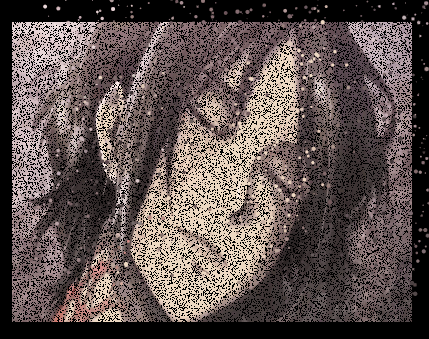
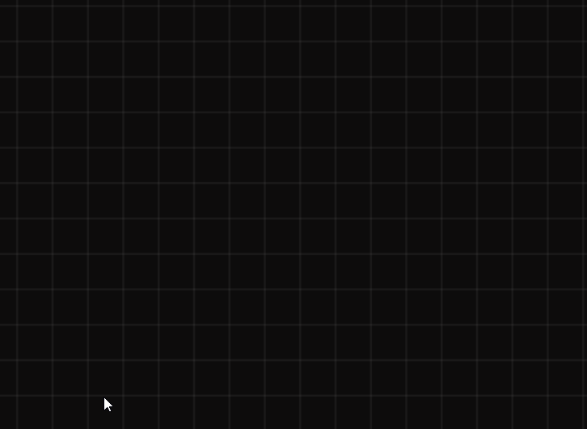

# Canvas 的各种令人惊叹效果，以及辅助工具

<div align="center">
  <a href="./README.en.md">English</a>
  <a href="./README.md">中文</a>
</div>

<br />

<div align="center">
  
  
  
  
  
  
</div>

一个功能丰富的 Canvas 效果库，提供了多种令人惊叹的视觉效果和实用工具。包含烟花、星空、水波纹、科技数字雨等多种动画效果，以及图像处理、截图、绘图、抠图等实用功能。

## 🎬 效果预览

请到 Github 查看: https://github.com/beixiyo/jl-cvs

<div align="center">
  
  
  
  
</div>

<div align="center">
  
  
  
  
</div>

<div align="center">
  
  
  
</div>

## ✨ 特性

- 🎨 **丰富的视觉效果**：烟花、星空、水波纹、科技数字雨等多种动画效果
- 🖼️ **图像处理工具**：抠图、智能选取、图像转文字、图像淡化、边缘提取、噪点化、水印添加等
- 📊 **图像数据处理**：灰度化、对比度增强、二值化、颜色替换等ImageData处理算法
- 🎯 **交互式组件**：刮刮卡、截图工具、绘图画板等
- 🎬 **视频处理**：截取视频帧、时间轴导航、批量帧提取等
- 📱 **响应式设计**：支持多种屏幕尺寸和设备
- 🌙 **主题支持**：支持明暗主题切换
- 🔧 **高度可配置**：所有效果都提供丰富的配置选项
- 📚 **完整文档**：所有配置都有中文的文档注释，详见 TS 类型文件和文档注释

## 安装

```bash
npm i @jl-org/cvs
```

## 示例页面目录

### 📋 快速导航
- [🎆 烟花效果 (Firework)](#-烟花效果-firework) - `/firework`
- [🌍 球体地球仪 (GlobeSphere)](#-球体地球仪-globesphere) - `/globeSphere`
- [📐 网格效果 (Grid)](#-网格效果-grid) - `/grid`
- [🌀 半调波浪 (HalftoneWave)](#-半调波浪-halftonewave) - `/halftoneWave`
- [🖼️ 图像灰飞烟灭 (ImgToFade)](#️-图像灰飞烟灭-imgtofade) - `/imgToFade`
- [📝 图像转文字 (ImgToTxt)](#-图像转文字-imgtotxt) - `/imgToTxt`
- [🎨 图像编辑画板 (NoteBoard)](#-图像编辑画板-noteboard) - `/noteBoard`
- [🎯 刮刮卡效果 (Scratch)](#-刮刮卡效果-scratch) - `/scratch`
- [📸 截图工具 (ShotImg)](#-截图工具-shotimg) - `/shotImg`
- [⭐ 星空场景 (StarField)](#-星空场景-starfield) - `/starField`
- [💡 智能选取 (SmartSelection)](#-智能选取-smartselection) - `/smartSelection`
- [✂️ 抠图工具 (CutoutImg)](#️-抠图工具-cutoutimg) - `/cutoutImg`
- [🔢 科技数字 (TechNum)](#-科技数字-technum) - `/techNum`
- [🌊 水波纹效果 (WaterRipple)](#-水波纹效果-waterripple) - `/waterRipple`
- [〰️ 波浪线条 (WavyLines)](#️-波浪线条-wavylines) - `/wavyLines`
- [🖼️ 图像处理 (ImgProcessing)](#️-图像处理-imgprocessing) - `/imgProcessing`
- [📊 图像数据处理 (ImgDataProcessing)](#-图像数据处理-imgdataprocessing) - `/imgDataProcessing`
- [🔍 图像边缘检测 (ImgEdgeDetection)](#-图像边缘检测-imgedgedetection) - `/imgEdgeDetection`
- [🎬 截取视频帧 (CaptureVideoFrame)](#-截取视频帧-capturevideoframe) - `/captureVideoFrame`

### 运行测试页面

```bash
# 安装依赖
pnpm install

# 构建核心包
pnpm build
# 启动测试页面
pnpm test
```

访问 http://localhost:5173 即可查看所有测试页面

---

## 🎆 烟花效果 (Firework)

- **在线查看**: https://jl-cvs.pages.dev/firework
- [文件位置](./packages/test/src/views/firework/index.tsx)


**功能特性**:
- 两种烟花类型：经典烟花和二段爆炸烟花
- 多种颜色主题预设
- 实时参数调整
- 自动播放和手动控制
- 丰富的视觉效果

**烟花类型**:
- 🎆 经典烟花：传统的烟花爆炸效果
- 💥 二段爆炸烟花：更复杂的多层爆炸效果

## 🌍 球体地球仪 (GlobeSphere)

- **在线查看**: https://jl-cvs.pages.dev/globeSphere
- [文件位置](./packages/test/src/views/globeSphere/index.tsx)


**功能特性**:
- 3D 球体旋转效果
- 地球仪样式渲染
- 交互式控制
- 平滑动画过渡

---

## ✂️ 抠图工具 (CutoutImg)

- **在线查看**: https://jl-cvs.pages.dev/cutoutImg


**功能特性**:
- **画笔编辑**: 支持画笔涂抹和擦除，实时预览抠图效果
- **参数调整**: 可自定义画笔粗细
- **交互控制**: 支持撤销、重做、拖拽和清空画布
- **图片导出**: 可下载编辑后的图片

**使用方法**:
- 在左侧画布使用画笔涂抹需要保留的区域
- 右侧将实时预览抠图效果
- 可通过工具栏调整画笔大小或切换为拖拽模式
- 完成后可下载图片

---

## 💡 智能选取 (SmartSelection)

- **在线查看**: https://jl-cvs.pages.dev/smartSelection


**功能特性**:
- **智能识别**: 自动识别图像中的不同区域
- **悬停高亮**: 鼠标悬停时高亮显示可选择区域
- **点击选择**: 单击即可选中或取消选中区域
- **多区域选择**: 支持同时选择多个独立区域

**使用方法**:
- 鼠标在图像上移动，可交互区域会高亮显示
- 点击高亮区域即可将其选中
- 再次点击可取消选择

---

## 📐 网格效果 (Grid)

- **在线查看**: https://jl-cvs.pages.dev/grid
- [文件位置](./packages/test/src/views/grid/index.tsx)



**功能特性**:
- 动态网格背景
- 网格线条动画
- 可调节网格密度
- 多种样式选项

## 🌀 半调波浪 (HalftoneWave)

- **在线查看**: https://jl-cvs.pages.dev/halftoneWave
- [文件位置](./packages/test/src/views/halftoneWave/index.tsx)


**功能特性**:
- 半调风格的波浪动画
- 动态点阵效果
- 可调节波浪参数
- 多种视觉样式

## 🖼️ 图像灰飞烟灭 (ImgToFade)

- **在线查看**: https://jl-cvs.pages.dev/imgToFade
- [文件位置](./packages/test/src/views/imgToFade/index.tsx)


**功能特性**:
- 图像渐变淡化效果
- 多种淡化模式
- 实时预览
- 自定义淡化参数

## 📝 图像转文字 (ImgToTxt)

- **在线查看**: https://jl-cvs.pages.dev/imgToTxt
- [文件位置](./packages/test/src/views/imgToTxt/index.tsx)


**功能特性**:
- 将图像转换为 ASCII 字符
- 多种字符集选择
- 可调节转换精度
- 实时转换预览

## 🎨 图像编辑画板 (NoteBoard)

- **在线查看**: https://jl-cvs.pages.dev/noteBoard
- [文件位置](./packages/test/src/views/noteBoard/index.tsx)
- [架构设计文档](packages/jl-cvs/src/NoteBoard/README.md)


**功能特性**:
- 功能完整的 Canvas 画板组件
- 多种绘图模式：绘制、擦除、拖拽、图形绘制
- 支持撤销/重做操作
- 图片上传和背景设置
- 分层导出功能
- 画笔样式自定义

**绘图模式**:
- ✏️ 绘制：自由绘制线条
- 🧽 擦除：擦除已绘制内容
- ✋ 拖拽：拖拽移动画布
- ⬜ 矩形：绘制矩形图形
- ⭕ 圆形：绘制圆形图形
- ➡️ 箭头：绘制箭头图形

### 3.0 迁移说明

1. `draw` 绘制模式改名为 `brush`
2. 事件从构造器传入 `onXxx` 改为事件系统，比如 `noteBoard.on('wheel', ({ scale }) => {})`
3. 添加无限画布功能，从 CSS Transform 方法改成了 Canvas Api 缩放
4. 添加 `addShape` 方法，可以自由添加图形
5. `Mode` 类型改名为 `NoteBoardMode`，更加语义化

## 🎯 刮刮卡效果 (Scratch)

- **在线查看**: https://jl-cvs.pages.dev/scratch
- [文件位置](./packages/test/src/views/scratch/index.tsx)


**功能特性**:
- 真实的刮刮卡交互体验
- 可自定义刮涂粗细和样式
- 实时刮开进度计算
- 多种预设配置
- 支持鼠标和触摸操作

**配置选项**:
- **bg**: 刮刮卡背景色
- **lineWidth**: 刮涂线条粗细
- **lineCap**: 线条端点样式 (round/square/butt)
- **lineJoin**: 线条连接样式 (round/bevel/miter)

## 📸 截图工具 (ShotImg)

- **在线查看**: https://jl-cvs.pages.dev/shotImg
- [文件位置](./packages/test/src/views/shotImg/index.tsx)


**功能特性**:
- 拖拽选择截图区域
- 支持图片上传和预览
- 实时显示选择区域尺寸
- 支持多种输出格式 (base64/blob)
- 蒙层透明度可调节

**使用方法**:
- 上传图片后，在画布上拖拽选择截图区域
- 支持精确的像素级选择
- 可导出选中区域为图片

## ⭐ 星空场景 (StarField)

- **在线查看**: https://jl-cvs.pages.dev/starField
- [文件位置](./packages/test/src/views/starField/index.tsx)


**功能特性**:
- 动态星空背景效果
- 星星闪烁和移动动画
- 可自定义星星数量、大小、颜色
- 支持多种颜色主题
- 响应式画布尺寸调整

**配置选项**:
- **starCount**: 星星数量 (默认 300)
- **sizeRange**: 星星大小范围 [min, max]
- **speedRange**: 移动速度范围
- **colors**: 星星颜色数组或生成函数
- **backgroundColor**: 背景颜色
- **flickerSpeed**: 闪烁频率

## 🔢 科技数字 (TechNum)

- **在线查看**: https://jl-cvs.pages.dev/techNum
- [文件位置](./packages/test/src/views/techNum/index.tsx)


**功能特性**:
- 《黑客帝国》风格数字雨效果
- 可自定义字符集和颜色
- 多种字体选择
- 流动速度和密度可调
- 经典绿色黑客主题

**配置选项**:
- **colWidth**: 字符列宽度
- **fontSize**: 字体大小
- **font**: 字体类型 (支持等宽字体)
- **maskColor**: 蒙层颜色 (用于淡出效果)
- **gapRate**: 列重置概率 (0-1)
- **durationMS**: 动画间隔时间
- **getStr**: 自定义字符生成函数
- **getColor**: 自定义颜色生成函数

## 🌊 水波纹效果 (WaterRipple)

- **在线查看**: https://jl-cvs.pages.dev/waterRipple
- [文件位置](./packages/test/src/views/waterRipple/index.tsx)


**功能特性**:
- 逼真的水波纹扩散动画
- 可调节波纹中心位置
- 多种预设效果 (快速波纹、慢速大波纹、彩色渐变)
- 支持自定义描边样式
- 实时参数调整

**配置选项**:
- **width/height**: 画布尺寸
- **xOffset/yOffset**: 波纹中心偏移量
- **lineWidth**: 波纹线条宽度
- **circleCount**: 同时显示的波纹圈数
- **intensity**: 动画速度强度
- **strokeStyle**: 自定义描边样式

## 〰️ 波浪线条 (WavyLines)

- **在线查看**: https://jl-cvs.pages.dev/wavyLines
- [文件位置](./packages/test/src/views/wavyLines/index.tsx)


**功能特性**:
- 动态波浪线条背景
- 鼠标交互效果
- 可调节线条密度和间距
- 多种颜色主题
- 平滑的动画过渡

**配置选项**:
- **xGap/yGap**: 线条间距
- **extraWidth/extraHeight**: 额外绘制区域
- **mouseEffectRange**: 鼠标影响范围
- **strokeStyle**: 线条颜色

---

## 🖼️ 图像处理 (ImgProcessing)

- **在线查看**: https://jl-cvs.pages.dev/imgProcessing
- [文件位置](./packages/test/src/views/imgProcessing/index.tsx)

**功能特性**:
- **噪点化处理**: 为图像添加噪点效果，可调节噪点强度
- **水印添加**: 支持自定义文字水印，可设置字体大小、间距、颜色和旋转角度
- **实时预览**: 调整参数时实时显示处理效果
- **原图对比**: 并排显示原图和处理后的图像

**配置选项**:
- **noiseLevel**: 噪点强度 (数值越大噪点越多)
- **watermarkText**: 水印文字内容
- **fontSize**: 水印字体大小
- **gap**: 水印间距
- **color**: 水印颜色 (支持透明度)
- **rotate**: 水印旋转角度

## 📊 图像数据处理 (ImgDataProcessing)

- **在线查看**: https://jl-cvs.pages.dev/imgDataProcessing
- [文件位置](./packages/test/src/views/imgDataProcessing/index.tsx)

**功能特性**:
- **灰度化处理**: 使用加权灰度化算法将彩色图像转为灰度图
- **对比度增强**: 调整图像对比度，让细节更清晰
- **二值化处理**: 将图像转换为黑白两色，用于图像识别等场景
- **颜色替换**: 将图像中指定颜色替换为目标颜色
- **组合处理**: 支持多种算法组合使用

**配置选项**:
- **contrastFactor**: 对比度增强因子 (默认 1.2)
- **binarizeThreshold**: 二值化阈值 (0-255)
- **fromColor/toColor**: 颜色替换的源颜色和目标颜色

## 🔍 图像边缘检测 (ImgEdgeDetection)

- **在线查看**: https://jl-cvs.pages.dev/imgEdgeDetection
- [文件位置](./packages/test/src/views/imgEdgeDetection/index.tsx)


**功能特性**:
- **边缘提取**: 使用Sobel算子检测图像边缘
- **阈值调节**: 可调节边缘检测的灵敏度阈值
- **实时处理**: 参数调整时实时显示边缘检测结果
- **原图对比**: 并排显示原图和边缘检测结果

**配置选项**:
- **threshold**: 边缘检测阈值 (0-255，数值越小检测到的边缘越多)

## 🎬 截取视频帧 (CaptureVideoFrame)

- **在线查看**: https://jl-cvs.pages.dev/captureVideoFrame
- [文件位置](./packages/test/src/views/captureVideoFrame/index.tsx)

**功能特性**:
- **视频上传**: 支持拖拽或点击上传视频文件
- **时间轴导航**: 直观的视频时间轴，可精确定位帧位置
- **批量截取**: 支持一次性截取多个时间点的帧
- **高质量输出**: 支持调节输出图片质量和格式
- **下载功能**: 可下载截取的帧图像

**使用方法**:
- 上传视频文件或使用默认演示视频
- 在时间轴上点击或拖拽选择要截取的时间点
- 支持精确到毫秒级的帧定位
- 可批量截取多个帧并下载

---

## 📚 API 函数文档

### 全部分类
- **🖼️ 图像处理**: 噪点、水印、叠图、裁剪、压缩、Canvas 导出、下载与格式转换
- **✂️ 抠图**: 遮罩生成、基于遮罩的裁切、平滑边缘
- **🔍 图像边缘**: Sobel 边缘检测
- **🎬 截取视频帧**: 支持 Worker 与 Canvas 降级
- **🧪 ImageData 处理**: 灰度、对比度、二值化、颜色替换、灰度数组
- **🧰 Canvas 辅助**: 字体、清空、DPR、坐标、像素访问、尺寸工具
- **🎨 颜色处理**: RGBA 解析、RGB/HEX 转换、透明度处理
- **⚙️ 通用工具**: 防抖/节流、深拷贝、随机数、字符串、撤销重做链表
- **🧩 SVG**: 棋盘、网格、文本
- **✨ 动画与组件类**: 网格、点阵网格、半调波浪、波浪线、水波纹、球体、星空、截图、画板、烟花、数字雨

---

### 🖼️ 图像处理
- **imgToNoise(img, level?)**: 为图片添加噪点
  - 用途: 快速生成胶片颗粒或老照片质感
  - 用法:
  ```ts
  const cvs = imgToNoise(img)
  document.body.appendChild(cvs)
  ```

- **waterMark({ text, fontSize, gap, color, rotate })**: 生成平铺水印
  - 返回: `{ base64, size }`
  - 用法:
  ```css
  /* CSS 示例 */
  background-image: url(${base64})
  background-size: ${size}px ${size}px
  ```

- **composeImg([{ src, left, top }], width, height)**: 用 Canvas 叠加多图并导出 base64
  - 用法:
  ```ts
  const base64 = await composeImg([
    { src: '/bg.png' },
    { src: fileBlob, left: 40, top: 60 },
  ], 800, 600)
  ```

- **cutImg(img, opts, resType?)**: 裁剪图片区域，支持导出 base64/blob
  - 关键项: `x y width height mimeType quality`

- **compressImg(img, resType?, quality?, mimeType?)**: 压缩图片
  - 仅 `image/jpeg | image/webp` 支持有损压缩

- **getCvsImg(cvs, resType?, mimeType?, quality?)**: 将 Canvas 导出为 base64/blob

- **下载与格式转换**:
  - `downloadByData(data, filename)`、`downloadByUrl(url, filename)`
  - `blobToBase64(blob)`、`base64ToBlob(base64, mimeType?)`
  - `urlToBlob(url)`、`getImg(src)`

---

### ✂️ 抠图
- **cutoutImgToMask(imgUrl, replaceColor, opts?)**: 抠图转遮罩（非透明区替换为指定颜色）
  - 选项: `smoothEdge` 边缘平滑、`smoothRadius` 半径、`alphaThreshold` 阈值、`ignoreAlpha` 是否忽略原 alpha、`handleAlpha` 自定义透明度
  - 适合生成下载/叠加用的纯色遮罩图

- **cutoutImg(original, mask)**: 基于遮罩图的不透明区域裁取原图
  - 使用 `globalCompositeOperation` 实现，输出透明 PNG base64

- **cutoutImgSmoothed(original, mask, { blurRadius, featherAmount })**: 像素级平滑边缘裁切
  - 输出 `ImageData`

---

### 🔍 图像边缘
- **getImgEdge(source, { threshold }?)**: 使用 Sobel 算子提取边缘
  - `source` 可为图片 URL 或 `ImageData`
  - 返回 `ImageData`

---

### 🎬 截取视频帧
- **captureVideoFrame(fileOrUrl, time, resType?, options?)**: 截取指定时间点的帧
  - 自动选择: 支持 `ImageCapture` 用 Worker，缺失时降级 Canvas
  - `time` 支持数字或数组，`resType` 支持 `'base64' | 'blob'`
  - 示例：批量截帧并导出 base64
  ```ts
  const frames = await captureVideoFrame(file, [1, 2, 8], 'base64', {
    quality: 0.6
  })
  ```

---

### 🧪 ImageData 处理
- **adaptiveGrayscale(imageData)**: 加权灰度化
- **enhanceContrast(imageData, factor=1.2)**: 对比度增强
- **adaptiveBinarize(imageData, threshold=128)**: 二值化（建议在灰度与对比度增强之后调用）
- **changeImgColor(imgOrUrl, fromColor, toColor, opts?)**: 指定颜色替换
  - 可自定义 `isSameColor(pixel, x, y, index)`
  - 示例：将纯红替换为半透明蓝
  ```ts
  const { base64 } = await changeImgColor('/a.png', '#ff0000', 'rgba(0, 0, 255, .5)')
  ```
- **getGrayscaleArray(imageData)**: 获取灰度数组 `Uint8Array`

> 说明：旧文档中的 `pickImgArea`、`invertImgArea` 已移除（代码中不存在）。

---

### 🧰 Canvas 辅助
- 基础:
  - **setFont(ctx, { size, family, weight, textAlign, textBaseline, color })**
  - **clearAllCvs(ctx, canvas)**
  - **getDPR(max=2)**
  - **timeFunc(str) / genTimeFunc(str)**: 时间函数生成器（缓动/节拍）
- 尺寸/坐标:
  - **getWinWidth() / getWinHeight()**、**calcCoord(r, deg)**
  - **createCvs(width?, height?, options?) => { cvs, ctx }**
- 像素/数据:
  - **getImgData(imgOrUrl)**、**getImgDataIndex(x, y, width)**
  - **getPixel(x, y, imgData)**、**parseImgData(imgData)**、**fillPixel(ctx, x, y, color)**
  - **eachPixel(imgData, cb)**、**scaleImgData(imgData, scaleX, scaleY)**

---

### 🎨 颜色处理
- **getColorInfo(color)**: 解析 RGBA
- **getColor() / getColorArr(size)**: 随机颜色/数组
- **hexColorToRaw(color)**: 补全 HEX 长度（`#000 -> #000000`）
- **hexToRGB(color)**、**rgbToHex(color)**
- **lightenColor(color, strength?)**: 调整透明度
- **colorAddOpacity(color, opacity?)**: 给颜色叠加透明度（返回 HEX 带 alpha）

### ⚙️ 通用工具
- **debounce(fn, wait)** / **throttle(fn, wait)**
- **deepClone(obj)**、**excludeKeys(obj, keys)**
- **getRandomNum(min, max)**、**randomStr(len)**、**numFixed(num, digits)**
- **UnRedoLinkedList** / **createUnReDoList**: 撤销重做结构

---

### 🧩 SVG
- **genSvgBoard(width?, height?, gap?, opts?)**: 返回 `{ svg, g }`
- **genBoard(width?, height?, gap?, opts?)**: 返回棋盘 `g`
- **genSvg(viewBox?, width?, height?)**: 创建 `svg`
- **genGrid(width?, height?, gap?, opts?)**: 创建网格 `path`
- **genGridPath(width?, height?, gap?, needHorizontal?, needVertical?)**: 生成 `d`
- **genTextArr(width?, height?, gap?, opts?)**: 批量坐标文字

---

### ✨ 动画与组件类
- **Grid(canvas, options?)**: 动态网格背景，支持鼠标高亮、发光、虚线
- **DotGrid(canvas, options?)**: 点阵网格背景，带渐变高亮
- **HalftoneWave(canvas, options?)**: 半调波浪动画
- **WavyLines({ canvas, ... })**: 噪声驱动的波浪线
- **WaterRipple(options?)**: 水波纹扩散
  ```ts
  const ripple = new WaterRipple({ circleCount: 10 })
  document.body.appendChild(ripple.canvas)
  ```
- **GlobeSphere(canvas, options?)**: 点阵球体
- **StarField(canvas, options?)**: 星空背景
- **imgToFade(bgCanvas, opts)**: 图像灰飞烟灭
- **imgToTxt(options)**: 图像/视频转文本绘制
- **ShotImg(canvas, img?, opacity?)**: 截图工具
  ```ts
  const s = new ShotImg(cvs, img)
  const shot = await s.getShotImg('base64')
  ```
- **NoteBoard(options)** / **NoteBoardWithBase64(options)**: 画板（图形/撤销重做/缩放拖拽）
- **createScratch(canvas, opts?)**: 刮刮卡交互
- **createFirework(canvas, opts?)** / **createFirework2(canvas, opts)**: 烟花效果
- **createTechNum(options)**: 科技数字雨

> 复杂类的完整参数可参考对应示例页面或类型定义（`packages/jl-cvs/src/**`）。
