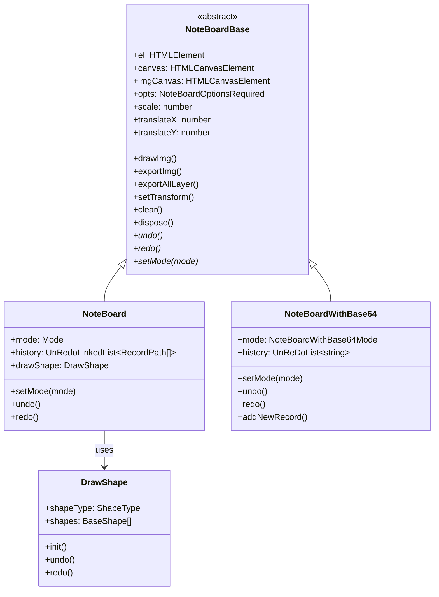

## `NoteBoard` 绘图板库文档

### 1. 简介

`NoteBoard` 是一个功能丰富的 **HTML5 Canvas** 绘图库。它旨在提供一个高性能、可扩展的画板解决方案，支持多种绘图模式、图层管理、历史记录 (撤销/重做)、画布变换 (拖拽/缩放) 以及灵活的图像导出功能。

该库的核心设计思想是 **分层画布** 和 **两种历史记录策略**，以满足不同场景下的需求。

### 2. 功能特性

- **多模式绘图**:
  - **画笔模式** (`draw`): 进行自由涂鸦。
  - **橡皮擦模式** (`erase`): 擦除画笔内容。
  - **图形绘制**: 支持绘制 **矩形** (`rect`)、**圆形** (`circle`)、**箭头** (`arrow`) 等。
- **画布操作**:
  - **拖拽** (`drag`): 平移整个画布。
  - **缩放**: 通过鼠标滚轮以光标为中心进行缩放。
  - **右键拖拽**: 支持在任意模式下按住鼠标右键进行拖拽。
- **历史记录**:
  - **撤销** (`undo`): 撤销上一步操作。
  - **重做** (`redo`): 恢复已撤销的操作。
- **图层管理**:
  - 采用分层设计，**背景图片** 和 **画笔/图形** 分别绘制在不同的 Canvas 上，互不影响。
  - 支持动态添加更多 Canvas 图层。
- **图像处理**:
  - **绘制背景图**: 可将图片绘制到底层画布，并支持 **自适应** (`autoFit`) 和 **居中** (`center`) 显示。
  - **导出图像**:
    - 可导出任意指定图层 (如仅导出画笔内容)。
    - 可将所有图层合并导出为一张图片。
    - 支持仅导出图片内容区域，并还原为原始分辨率。
- **高可定制性**:
  - 支持自定义画布尺寸、缩放范围、画笔样式 (颜色、粗细、线帽)、混合模式等。
  - 提供丰富的生命周期钩子函数 (`onMouseDown`, `onDrag`, `onUndo` 等)。
- **高性能**:
  - 针对高分屏 (HiDPI) 进行优化，绘图清晰不模糊。
  - 路径历史记录模式性能高，内存占用低。

### 3. 整体架构

`NoteBoard` 的核心架构基于三个类和一个工具模块，它们各司其职，共同构成了整个绘图系统。

#### 3.1. 核心类图

#### 3.2. 架构解析

1.  **`NoteBoardBase` (抽象基类)**
    - **职责**: 负责所有画板的 **基础能力** 和 **通用逻辑**。
    - **具体工作**:
      - **初始化**: 创建和管理多个 Canvas 元素。默认创建两个：`imgCanvas` (用于绘制背景图) 和 `canvas` (用于绘制画笔和图形)，并将它们叠加放入用户提供的容器元素 `el` 中。
      - **高分屏适配**: 处理 `devicePixelRatio` (dpr)，确保在高分辨率屏幕上绘图清晰。
      - **样式和尺寸**: 设置画布的尺寸、z-index 等基础样式。
      - **图像绘制**: 提供 `drawImg` 方法，负责加载图片并将其绘制到 `imgCanvas` 上。
      - **图像导出**: 提供 `exportImg`, `exportMask`, `exportAllLayer` 等方法，用于从 Canvas 生成 `base64` 图像数据。
      - **画布变换**: 实现 `setTransform` 方法，通过 CSS `transform` 属性来处理画布的缩放和平移，性能较高。
      - **资源清理**: `dispose` 方法用于移除事件监听、清空画布、释放内存。
    - **设计模式**: 它定义了画板必须具备的核心接口 (如 `undo`, `redo`, `setMode` 等) 为抽象方法，强制子类去实现具体逻辑。这遵循了 *模板方法模式* 的思想。

2.  **`NoteBoard` (标准实现)**
    - **职责**: 提供了 **最完整的功能**，特别是对 **图形绘制** 和 **高效历史记录** 的支持。
    - **历史记录策略**: 它采用 **基于路径 (`RecordPath`) 的历史记录**。
      - **工作原理**: 每一次 "下笔" (从 `mousedown` 到 `mouseup`) 会创建一个新的历史记录节点。在 `mousemove` 过程中，所有绘制的线段坐标 (`moveTo`, `lineTo`) 都会被记录到当前节点的 `path` 数组中。对于图形，则是将 `DrawShape` 实例中记录的图形对象 (`shapes`) 保存起来。
      - **优点**: 内存占用极低，性能好，因为只记录了关键数据而非整个画布的像素。可以对历史中的每个元素进行精细操作 (理论上)。
      - **缺点**: 重绘时需要遍历所有路径和图形并重新绘制，如果路径极其复杂，性能会下降。
    - **图形绘制**:
      - 它内部实例化了一个 `DrawShape` 类。
      - 当 `mode` 切换到 `rect`, `circle`, `arrow` 时，它会将事件处理委托给 `DrawShape` 实例，由 `DrawShape` 负责在 `canvas` 上绘制和管理图形。
      - 绘制完成后，`DrawShape` 中的图形列表会同步到 `NoteBoard` 的历史记录中。

3.  **`NoteBoardWithBase64` (备用实现)**
    - **职责**: 提供一个 **简化版** 的画板，不支持图形绘制，但实现简单。
    - **历史记录策略**: 它采用 **基于 `base64` 快照的历史记录**。
      - **工作原理**: 在每次 `mouseup` (一笔画完) 时，它会调用 `exportMask` 将整个 `canvas` 的内容导出为一个 `base64` 字符串，并存入历史记录链表。
      - **撤销/重做**: 执行 `undo` 或 `redo` 时，会从历史记录中取出对应的 `base64` 字符串，然后通过 `drawImage` 将这个快照重新绘制到画布上，从而恢复到某个历史状态。
      - **优点**: 实现非常简单，逻辑清晰。在任何复杂的绘图场景下，撤销/重做的性能是恒定的。
      - **缺点**:
        - **内存占用高**: 每个历史记录都是一张完整的图片，如果画布尺寸大或历史步骤多，会消耗大量内存。
        - **功能受限**: 无法进行图形绘制，因为所有内容都被 "压平" 成了像素点，丢失了图形对象的概念。

### 4. 核心流程与工作原理

#### 4.1. 初始化流程

1.  **`new NoteBoard(opts)`**: 用户传入 `el` (容器) 和其他配置项。
2.  **`NoteBoardBase` 构造函数**:
    - 合并用户配置和默认配置。
    - 根据 `devicePixelRatio` 调整宽高，以适配高分屏。
    - 创建 `imgCanvas` 和 `canvas` 两个 `HTMLCanvasElement`。
    - 将这两个 Canvas 添加到 `el` 容器中，并通过 `position: absolute` 和 `z-index` 进行分层叠放 (`imgCanvas` 在下，`canvas` 在上)。
    - 设置初始样式，如 `lineWidth`, `strokeStyle` 等。
3.  **子类 (`NoteBoard` 或 `NoteBoardWithBase64`) 构造函数**:
    - 调用 `super(opts)` 完成基类初始化。
    - 初始化自己的历史记录管理器 (`history`)。
    - **(`NoteBoard` only)**: 初始化 `DrawShape` 模块，并建立 `DRAW_MAP` 用于 `DrawShape` 和 `NoteBoard` 之间的通信。
    - 绑定事件 (`bindEvent`)。
    - 设置初始模式 (`setMode`)。

#### 4.2. 绘图流程 (`NoteBoard` 为例)

1.  **设置模式**: 调用 `setMode('draw')`。
    - 内部 `switch` 语句会根据模式进行设置。
    - `mode` 设为 `'draw'`。
    - 设置画笔光标样式。
    - 设置 `ctx.globalCompositeOperation` 为绘图模式 (默认为 `source-over`)。
2.  **鼠标按下 (`onMousedown`)**:
    - **创建历史记录**: 调用 `history.add()`，向历史记录链表中添加一个 **新的、空的** 路径节点。这标志着一笔新绘制的开始。
    - **开始绘制**: 设置 `isDrawing = true`，并调用 `ctx.beginPath()`。
    - 记录下笔的起始点 `drawStart`。
3.  **鼠标移动 (`onMousemove`)**:
    - **检查状态**: 如果 `isDrawing` 为 `true`。
    - **绘制**:
      - `ctx.moveTo(start.x, start.y)`: 将画笔移动到上一个点。
      - `ctx.lineTo(offsetX, offsetY)`: 从上一个点画线到当前鼠标位置。
      - `ctx.stroke()`: 将线段渲染到 `canvas` 上。
    - **记录路径**:
      - 获取当前历史记录节点 (`history.curValue`)。
      - 将 `{ moveTo: [...], lineTo: [...] }` 对象 `push` 到该节点的 `path` 数组中。
    - **更新起点**: 更新 `drawStart` 为当前鼠标位置，为下一次 `mousemove` 做准备。
4.  **鼠标抬起 (`onMouseup`)**:
    - **结束绘制**: 设置 `isDrawing = false`。
    - 至此，一笔完整的绘制操作和其数据记录就完成了。

#### 4.3. 撤销/重做流程 (`NoteBoard` 为例)

1.  **用户调用 `undo()`**:
2.  **历史指针移动**: `this.history.undo()` 将内部指针指向上一个历史记录节点，并返回该节点的值 (`recordPath`)。
3.  **处理图形撤销**:
    - 检查上一步操作是否是绘制图形 (`isShapeMode`)。
    - 如果是，则调用 `this.drawShape.undo()`，让 `DrawShape` 模块自己处理图形的撤销 (通常是将图形从其内部 `shapes` 数组中移除)。
4.  **重绘画布**:
    - 调用 `this.clear(false)` 清空上层 `canvas` (不清空背景图)。
    - **重绘图形**: 遍历当前历史记录中 `shapes` 数组，调用每个 `shape.draw()` 方法重绘所有有效图形。
    - **重绘笔迹**: 调用 `this.drawRecord()`，遍历当前历史记录中 `path` 数组，将所有线段重绘。
5.  **`redo()`** 流程与 `undo()` 类似，只是调用 `this.history.redo()` 将指针向后移动。

#### 4.4. 缩放/拖拽流程

- **缩放 (`onWheel`)**:
  1.  阻止默认滚动行为。
  2.  记录当前鼠标位置 `this.mousePoint` 作为缩放中心。
  3.  根据 `e.deltaY` 的正负来增加或减小 `this.scale` 的值。
  4.  调用 `setTransform()`。

- **拖拽 (`onMousedown` -> `onMousemove` -> `onMouseup`)**:
  1.  当 `mode` 为 `drag` 或按下右键时，`onMousedown` 会设置 `isDragging = true` 并记录拖拽起始点 `dragStart`。
  2.  `onMousemove` 中，如果 `isDragging` 为 `true`，则计算鼠标位移 `dx`, `dy`。
  3.  将位移累加到 `this.translateX` 和 `this.translateY` 上。
  4.  调用 `setTransform()`。
  5.  `onMouseup` 设置 `isDragging = false` 结束拖拽。

- **`setTransform()`**:
  - 这个是关键函数。它 **不会** 修改 Canvas 内部的坐标系或重绘任何东西。
  - 它只是更新 `canvas` 和 `imgCanvas` 这两个 HTML 元素的 **CSS `transform`** 和 **`transform-origin`** 属性。
  - `transform-origin` 设置为鼠标当前位置，实现以鼠标为中心的缩放。
  - `transform` 设置为 `scale(...) translate(...)`。
  - **优点**: 利用浏览器 GPU 进行硬件加速的图形变换，性能极高，远胜于通过 `ctx.scale` 和 `ctx.translate` 并重绘整个场景的方式。
